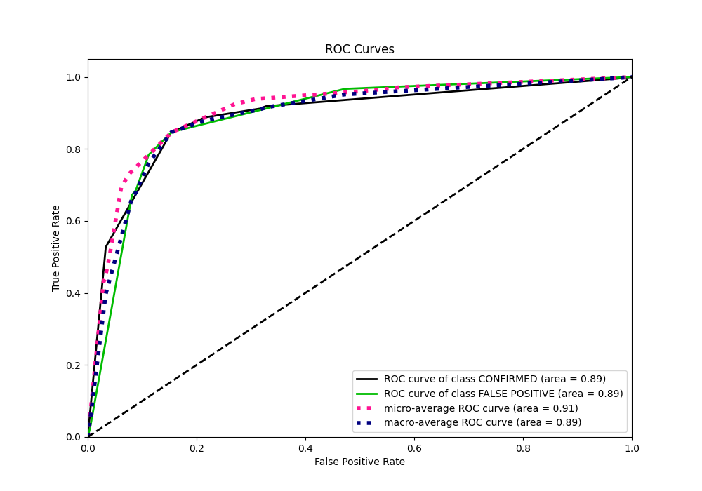

# Summary of 1_DecisionTree

[<< Go back](../README.md)

## Decision Tree
- **n_jobs**: -1
- **criterion**: gini
- **max_depth**: 3
- **explain_level**: 2

## Validation
 - **validation_type**: split
 - **train_ratio**: 0.75
 - **shuffle**: True
 - **stratify**: True

## Optimized metric
logloss

## Training time

7.0 seconds

## Metric details
|           |    score |   threshold |
|:----------|---------:|------------:|
| logloss   | 0.377679 | nan         |
| auc       | 0.890856 | nan         |
| f1        | 0.87619  |   0.357441  |
| accuracy  | 0.846457 |   0.357441  |
| precision | 0.936752 |   0.943787  |
| recall    | 1        |   0.0715385 |
| mcc       | 0.677622 |   0.357441  |

## Metric details with threshold from accuracy metric
|           |    score |   threshold |
|:----------|---------:|------------:|
| logloss   | 0.377679 |  nan        |
| auc       | 0.890856 |  nan        |
| f1        | 0.87619  |    0.357441 |
| accuracy  | 0.846457 |    0.357441 |
| precision | 0.907895 |    0.357441 |
| recall    | 0.846626 |    0.357441 |
| mcc       | 0.677622 |    0.357441 |

## Confusion matrix (at threshold=0.357441)
|                           |   Predicted as CONFIRMED |   Predicted as FALSE POSITIVE |
|:--------------------------|-------------------------:|------------------------------:|
| Labeled as CONFIRMED      |                      385 |                            70 |
| Labeled as FALSE POSITIVE |                      125 |                           690 |

## Learning curves

## Decision Tree 

### Tree #1

### Rules

if (koi_count <= 1.5) and (koi_fwm_stat_sig <= 0.002) and (koi_smet <= 0.09) then class: FALSE POSITIVE (proba: 94.64%) | based on 1,679 samples

if (koi_count > 1.5) and (koi_dikco_msky <= 1.73) and (koi_prad <= 15.2) then class: CONFIRMED (proba: 92.05%) | based on 780 samples

if (koi_count <= 1.5) and (koi_fwm_stat_sig > 0.002) and (koi_dikco_msky <= 1.055) then class: CONFIRMED (proba: 64.26%) | based on 719 samples

if (koi_count <= 1.5) and (koi_fwm_stat_sig > 0.002) and (koi_dikco_msky > 1.055) then class: FALSE POSITIVE (proba: 93.98%) | based on 299 samples

if (koi_count <= 1.5) and (koi_fwm_stat_sig <= 0.002) and (koi_smet > 0.09) then class: FALSE POSITIVE (proba: 70.33%) | based on 209 samples

if (koi_count > 1.5) and (koi_dikco_msky > 1.73) and (koi_count <= 2.5) then class: FALSE POSITIVE (proba: 97.26%) | based on 73 samples

if (koi_count > 1.5) and (koi_dikco_msky <= 1.73) and (koi_prad > 15.2) then class: FALSE POSITIVE (proba: 94.12%) | based on 34 samples

if (koi_count > 1.5) and (koi_dikco_msky > 1.73) and (koi_count > 2.5) then class: CONFIRMED (proba: 62.5%) | based on 16 samples

## Permutation-based Importance

## Confusion Matrix

## Normalized Confusion Matrix

## ROC Curve

## Kolmogorov-Smirnov Statistic

## Precision-Recall Curve

## Calibration Curve

## Cumulative Gains Curve

## Lift Curve

[<< Go back](../README.md)
