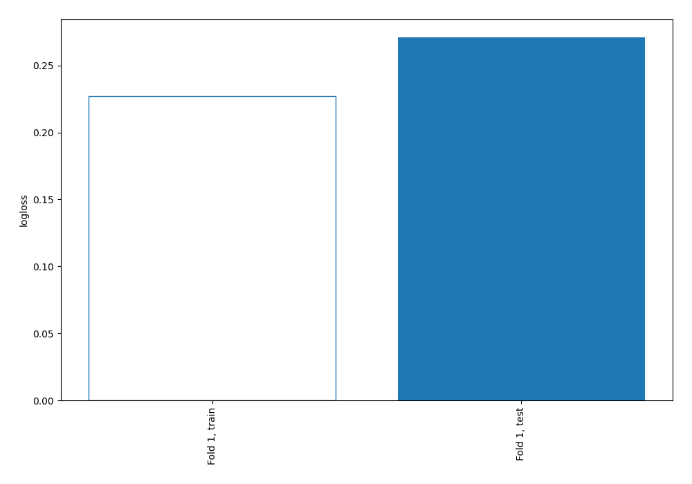
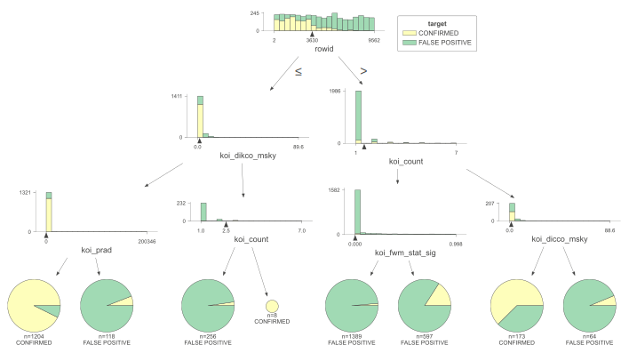
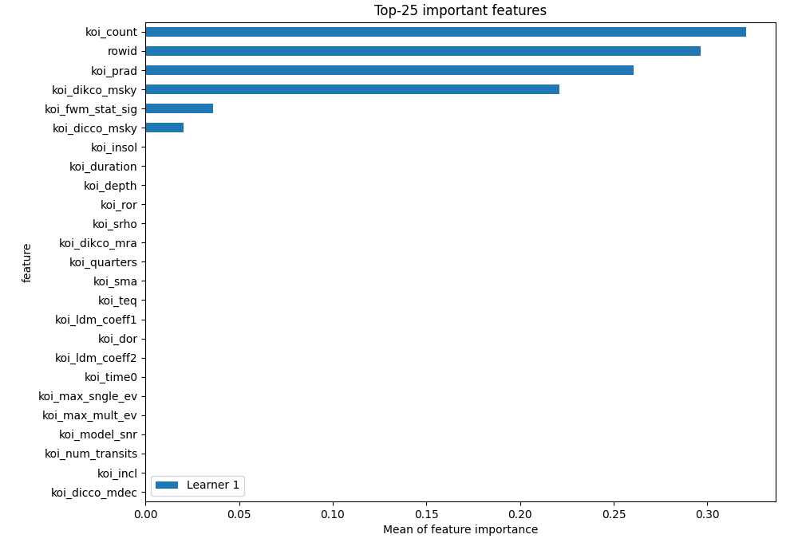
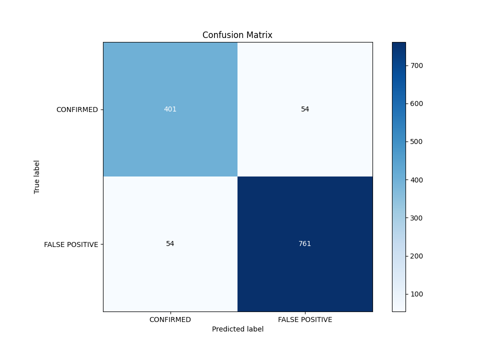
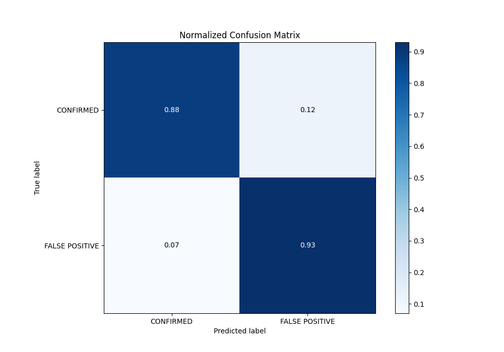
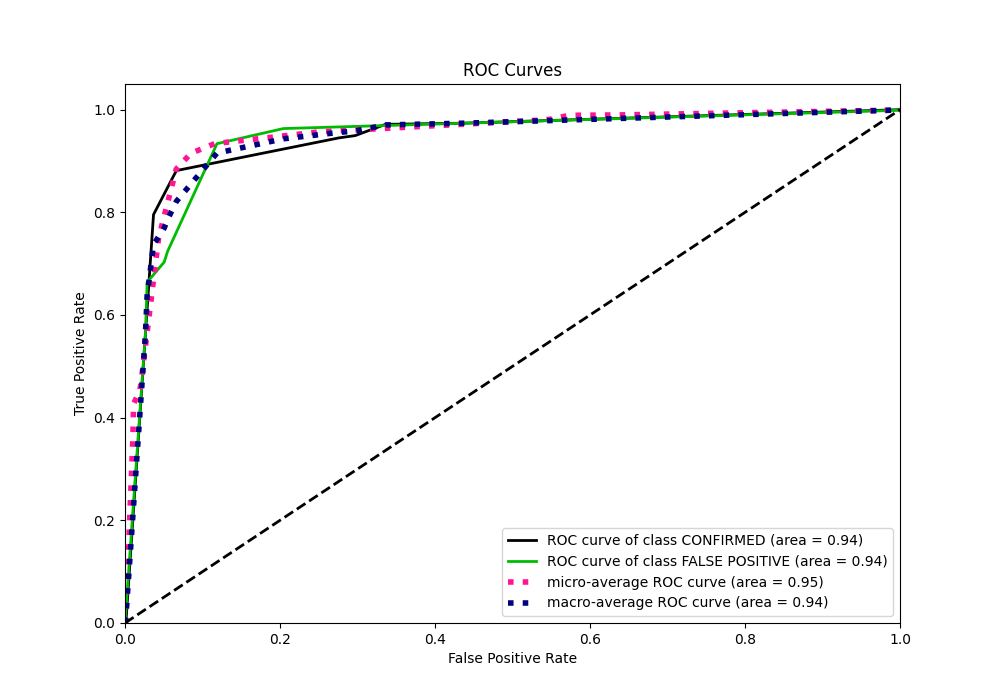
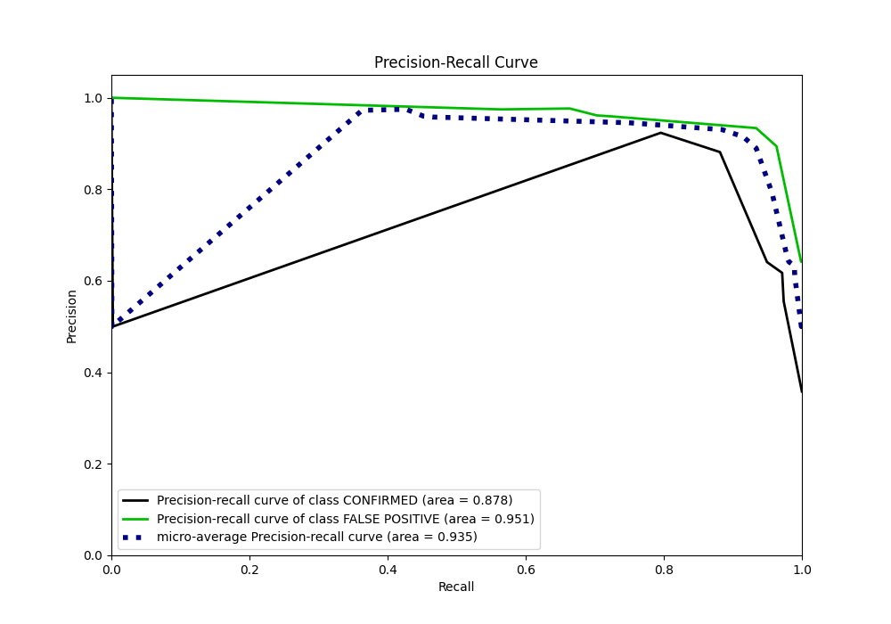
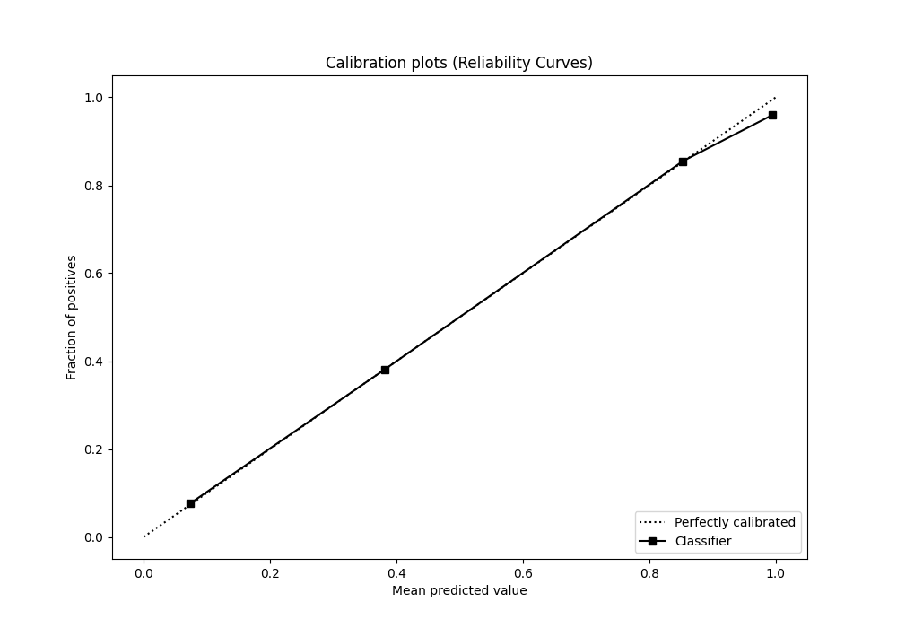
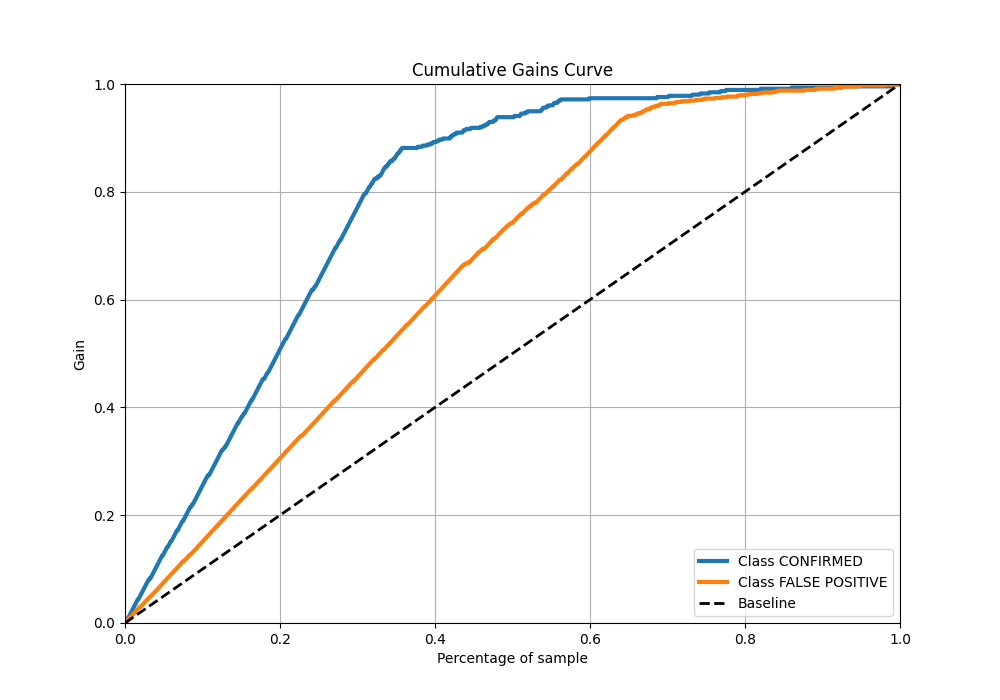
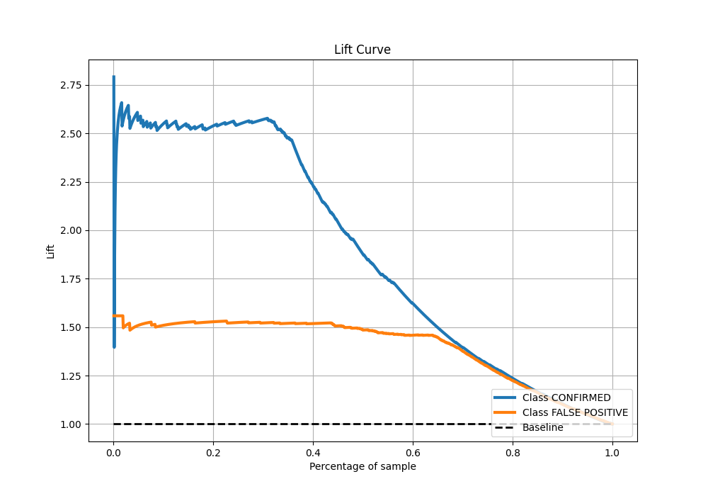

# Summary of 2_DecisionTree

[<< Go back](../README.md)

## Decision Tree
- **n_jobs**: -1
- **criterion**: gini
- **max_depth**: 3
- **explain_level**: 2

## Validation
 - **validation_type**: split
 - **train_ratio**: 0.75
 - **shuffle**: True
 - **stratify**: True

## Optimized metric
logloss

## Training time

6.7 seconds

## Metric details
|           |    score |   threshold |
|:----------|---------:|------------:|
| logloss   | 0.270943 |  nan        |
| auc       | 0.941587 |  nan        |
| f1        | 0.933742 |    0.375723 |
| accuracy  | 0.914961 |    0.375723 |
| precision | 0.976534 |    0.940678 |
| recall    | 0.998773 |    0        |
| mcc       | 0.815061 |    0.375723 |

## Metric details with threshold from accuracy metric
|           |    score |   threshold |
|:----------|---------:|------------:|
| logloss   | 0.270943 |  nan        |
| auc       | 0.941587 |  nan        |
| f1        | 0.933742 |    0.375723 |
| accuracy  | 0.914961 |    0.375723 |
| precision | 0.933742 |    0.375723 |
| recall    | 0.933742 |    0.375723 |
| mcc       | 0.815061 |    0.375723 |

## Confusion matrix (at threshold=0.375723)
|                           |   Predicted as CONFIRMED |   Predicted as FALSE POSITIVE |
|:--------------------------|-------------------------:|------------------------------:|
| Labeled as CONFIRMED      |                      401 |                            54 |
| Labeled as FALSE POSITIVE |                       54 |                           761 |

## Learning curves

## Decision Tree 

### Tree #1

### Rules

if (rowid > 3630.5) and (koi_count <= 1.5) and (koi_fwm_stat_sig <= 0.002) then class: FALSE POSITIVE (proba: 98.56%) | based on 1,389 samples

if (rowid <= 3630.5) and (koi_dikco_msky <= 1.755) and (koi_prad <= 13.78) then class: CONFIRMED (proba: 92.69%) | based on 1,204 samples

if (rowid > 3630.5) and (koi_count <= 1.5) and (koi_fwm_stat_sig > 0.002) then class: FALSE POSITIVE (proba: 84.09%) | based on 597 samples

if (rowid <= 3630.5) and (koi_dikco_msky > 1.755) and (koi_count <= 2.5) then class: FALSE POSITIVE (proba: 97.66%) | based on 256 samples

if (rowid > 3630.5) and (koi_count > 1.5) and (koi_dicco_msky <= 1.51) then class: CONFIRMED (proba: 62.43%) | based on 173 samples

if (rowid <= 3630.5) and (koi_dikco_msky <= 1.755) and (koi_prad > 13.78) then class: FALSE POSITIVE (proba: 94.07%) | based on 118 samples

if (rowid > 3630.5) and (koi_count > 1.5) and (koi_dicco_msky > 1.51) then class: FALSE POSITIVE (proba: 93.75%) | based on 64 samples

if (rowid <= 3630.5) and (koi_dikco_msky > 1.755) and (koi_count > 2.5) then class: CONFIRMED (proba: 100.0%) | based on 8 samples

## Permutation-based Importance

## Confusion Matrix

## Normalized Confusion Matrix

## ROC Curve

## Kolmogorov-Smirnov Statistic

## Precision-Recall Curve

## Calibration Curve

## Cumulative Gains Curve

## Lift Curve

[<< Go back](../README.md)
