# Summary of 3_Linear

[<< Go back](../README.md)

## Logistic Regression (Linear)
- **n_jobs**: -1
- **explain_level**: 2

## Validation
 - **validation_type**: split
 - **train_ratio**: 0.75
 - **shuffle**: True
 - **stratify**: True

## Optimized metric
logloss

## Training time

2.9 seconds

## Metric details
|           |    score |     threshold |
|:----------|---------:|--------------:|
| logloss   | 0.149103 | nan           |
| auc       | 0.985149 | nan           |
| f1        | 0.954545 |   0.449334    |
| accuracy  | 0.941732 |   0.449334    |
| precision | 1        |   0.999977    |
| recall    | 1        |   9.19702e-05 |
| mcc       | 0.873411 |   0.449334    |

## Metric details with threshold from accuracy metric
|           |    score |   threshold |
|:----------|---------:|------------:|
| logloss   | 0.149103 |  nan        |
| auc       | 0.985149 |  nan        |
| f1        | 0.954545 |    0.449334 |
| accuracy  | 0.941732 |    0.449334 |
| precision | 0.95572  |    0.449334 |
| recall    | 0.953374 |    0.449334 |
| mcc       | 0.873411 |    0.449334 |

## Confusion matrix (at threshold=0.449334)
|                           |   Predicted as CONFIRMED |   Predicted as FALSE POSITIVE |
|:--------------------------|-------------------------:|------------------------------:|
| Labeled as CONFIRMED      |                      419 |                            36 |
| Labeled as FALSE POSITIVE |                       38 |                           777 |

## Learning curves
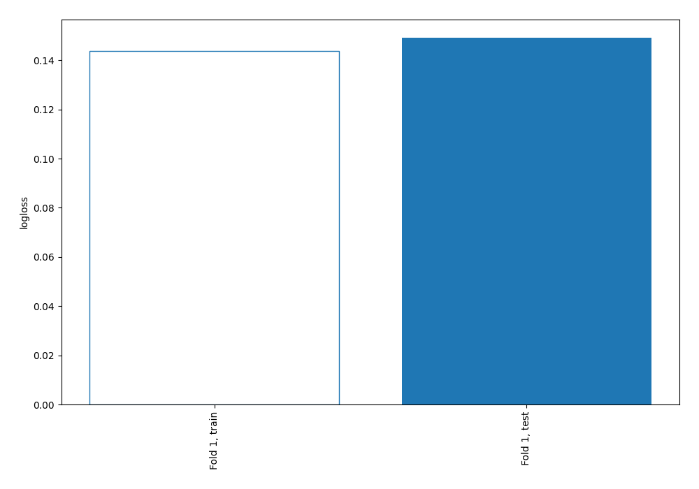

## Coefficients
| feature          |   Learner_1 |
|:-----------------|------------:|
| intercept        |   4.82128   |
| koi_depth        |   3.93101   |
| koi_impact       |   3.85408   |
| koi_dikco_msky   |   2.3697    |
| koi_max_sngle_ev |   2.26566   |
| koi_ror          |   2.25204   |
| koi_max_mult_ev  |   2.07797   |
| koi_dicco_msky   |   1.59686   |
| rowid            |   1.52785   |
| koi_dor          |   1.1722    |
| koi_jmag         |   1.06236   |
| koi_ldm_coeff1   |   0.941325  |
| koi_ldm_coeff2   |   0.757603  |
| koi_teq          |   0.746536  |
| koi_gmag         |   0.618058  |
| koi_fwm_sra      |   0.614362  |
| koi_srho         |   0.568515  |
| koi_duration     |   0.548424  |
| koi_insol        |   0.483947  |
| koi_period       |   0.476817  |
| koi_steff        |   0.476191  |
| koi_num_transits |   0.47397   |
| koi_kepmag       |   0.399217  |
| koi_srad         |   0.325253  |
| koi_rmag         |   0.312893  |
| koi_smass        |   0.303728  |
| koi_dikco_mdec   |   0.256604  |
| koi_prad         |   0.219947  |
| koi_dikco_mra    |   0.15576   |
| koi_time0        |   0.115972  |
| koi_time0bk      |   0.115939  |
| koi_quarters     |   0.110804  |
| koi_zmag         |   0.0949864 |
| dec              |   0.0907086 |
| koi_fwm_sdeco    |   0.0830317 |
| koi_slogg        |   0.0697048 |
| koi_fwm_pdeco    |   0.0402141 |
| koi_dicco_mra    |  -0.0142095 |
| koi_fwm_prao     |  -0.0591168 |
| koi_hmag         |  -0.0627441 |
| koi_fwm_srao     |  -0.109274  |
| koi_tce_plnt_num |  -0.149474  |
| koi_model_snr    |  -0.179647  |
| koi_dicco_mdec   |  -0.182301  |
| koi_fwm_sdec     |  -0.300093  |
| koi_bin_oedp_sig |  -0.315022  |
| ra               |  -0.459655  |
| koi_kmag         |  -0.640175  |
| koi_incl         |  -0.692183  |
| koi_count        |  -0.765179  |
| koi_imag         |  -1.39332   |
| koi_sma          |  -1.63119   |
| koi_fwm_stat_sig |  -1.65317   |
| koi_smet         |  -2.21675   |

## Permutation-based Importance
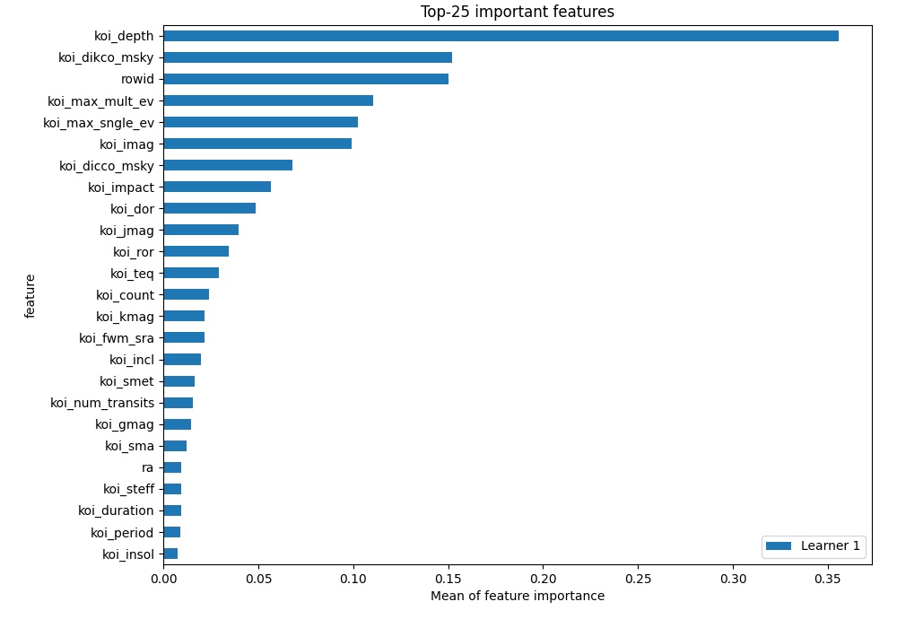
## Confusion Matrix

## Normalized Confusion Matrix

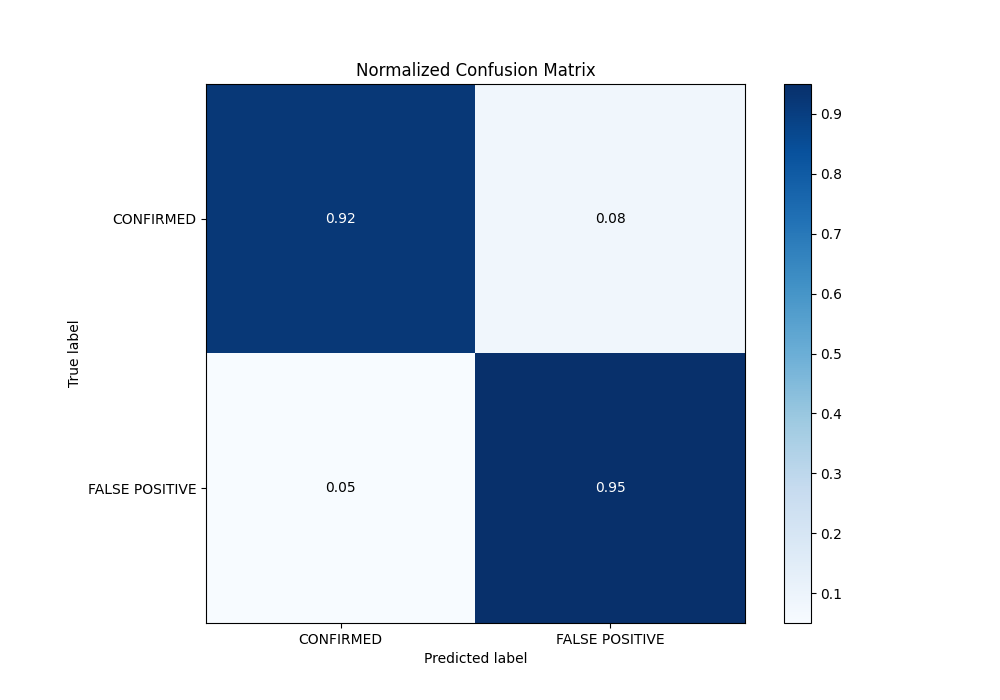

## ROC Curve

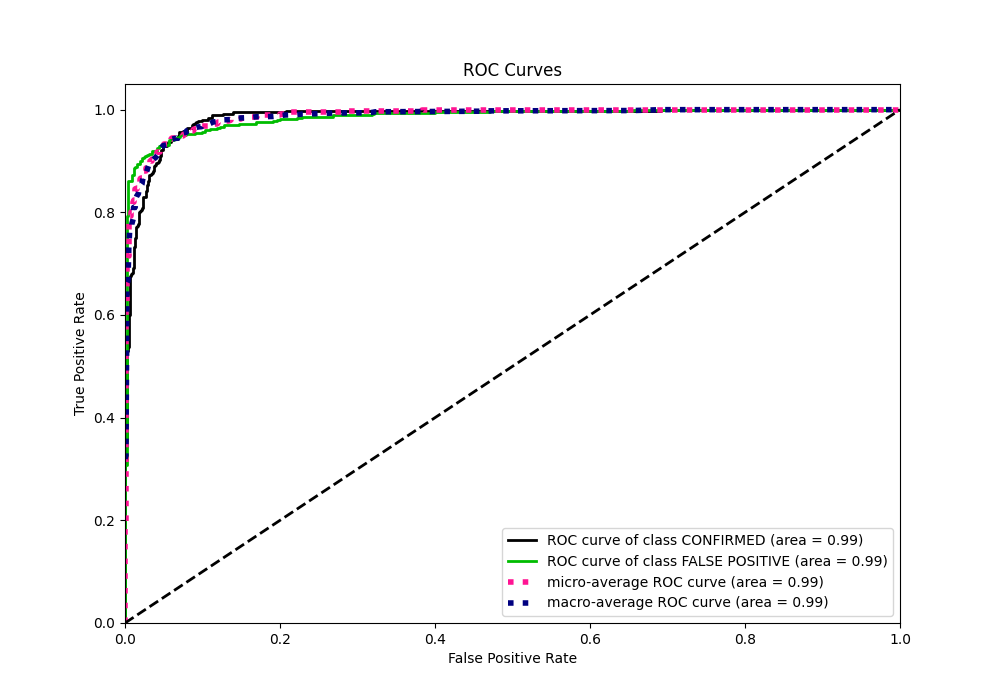

## Kolmogorov-Smirnov Statistic

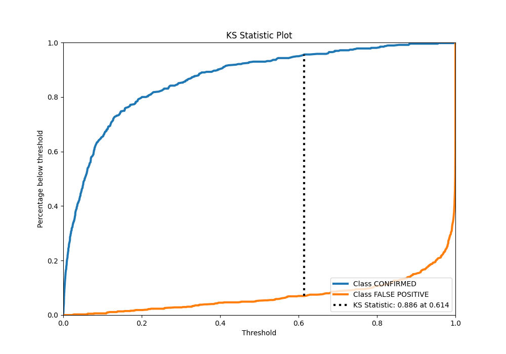

## Precision-Recall Curve

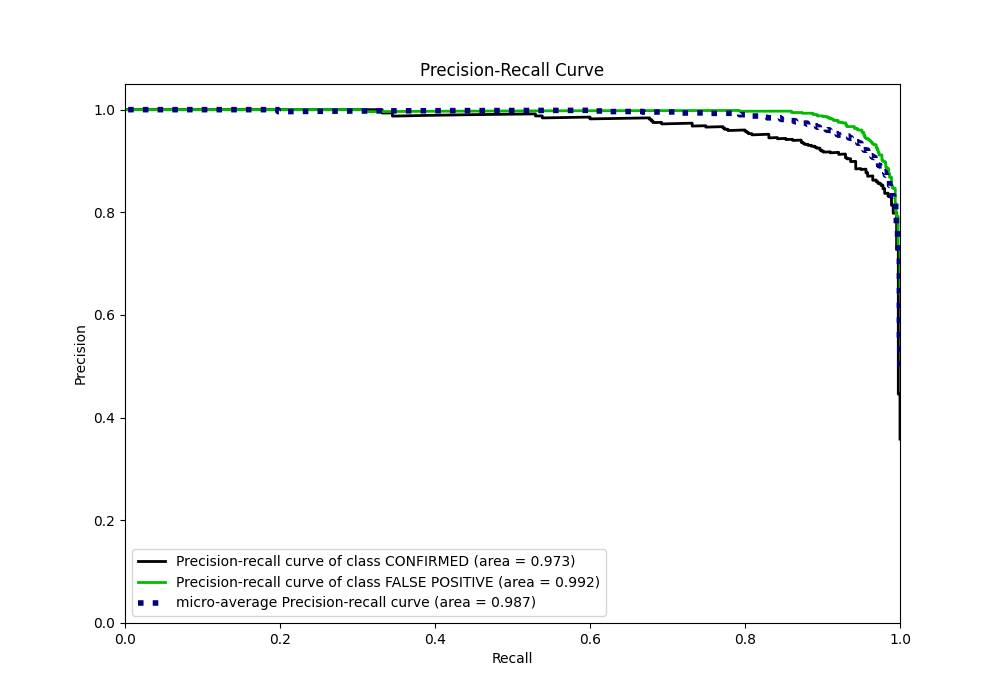

## Calibration Curve

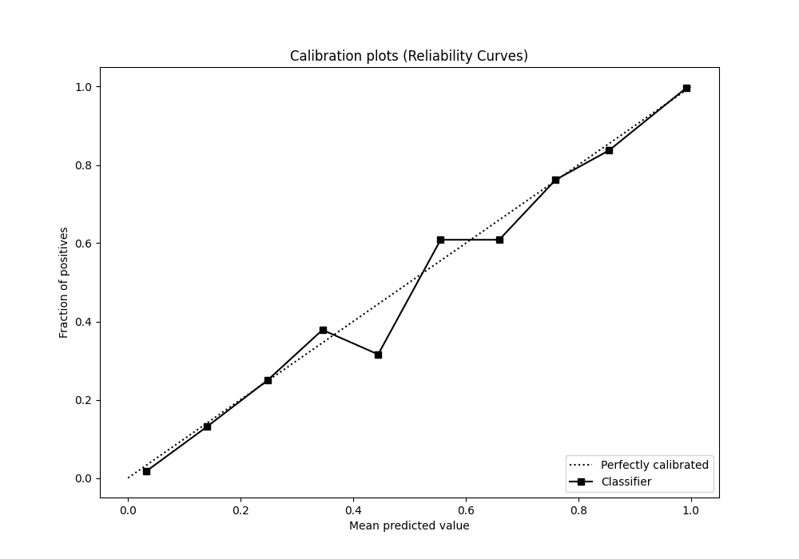

## Cumulative Gains Curve

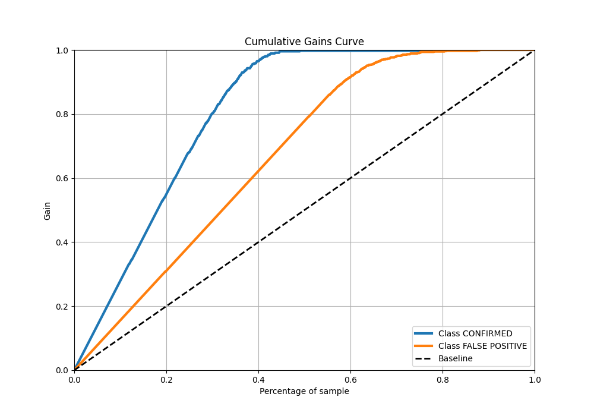

## Lift Curve

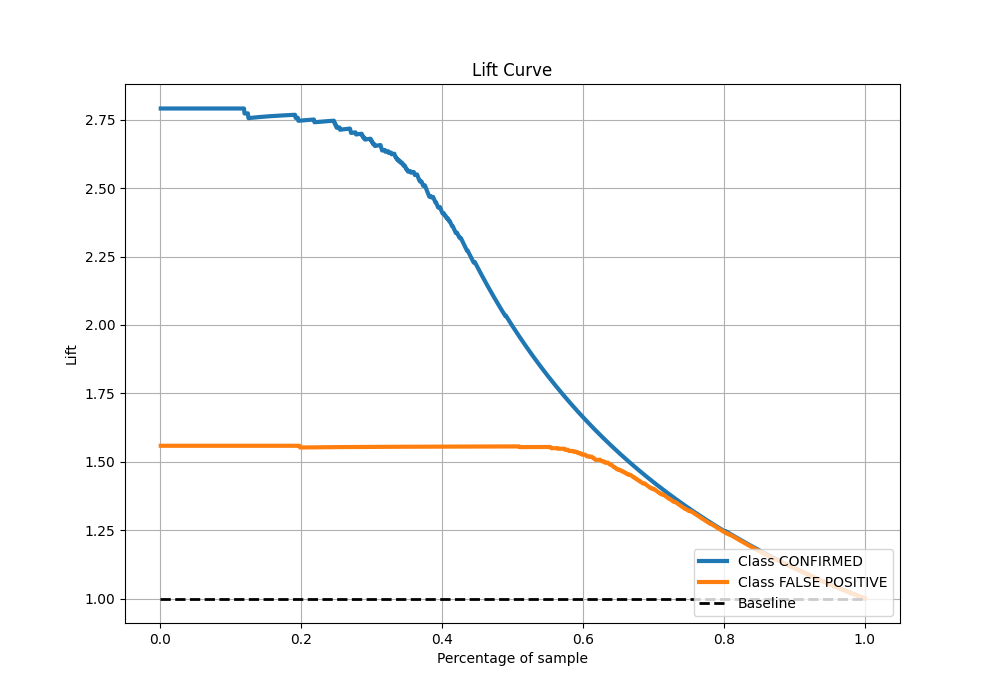

## SHAP Importance
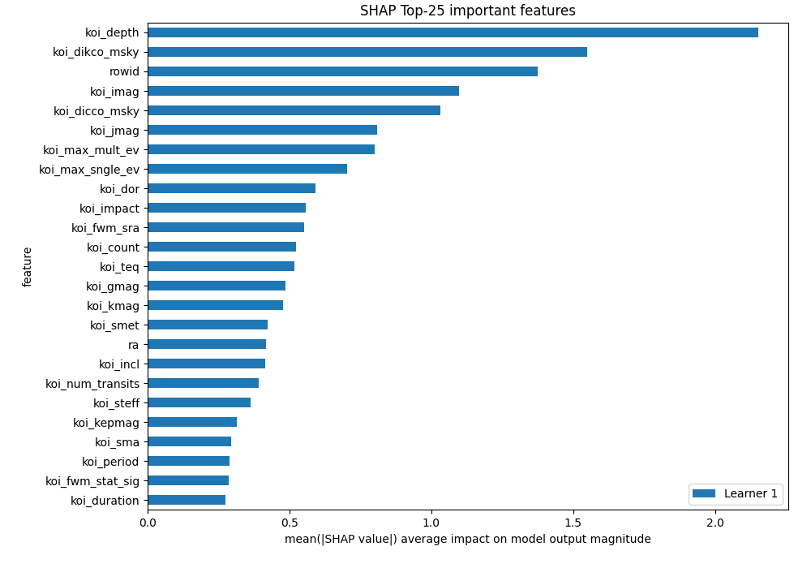

## SHAP Dependence plots

### Dependence (Fold 1)
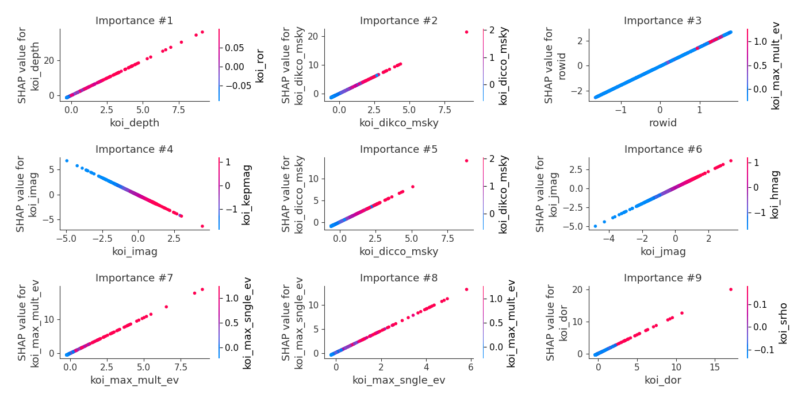

## SHAP Decision plots

### Top-10 Worst decisions for class 0 (Fold 1)
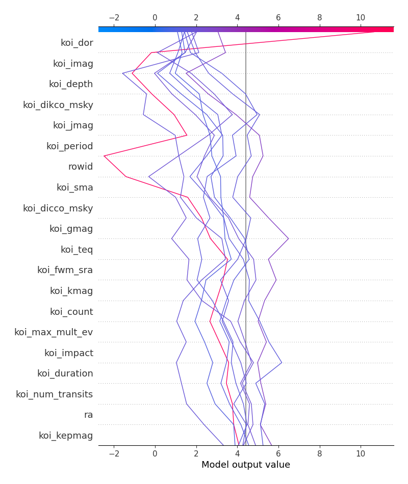
### Top-10 Best decisions for class 0 (Fold 1)
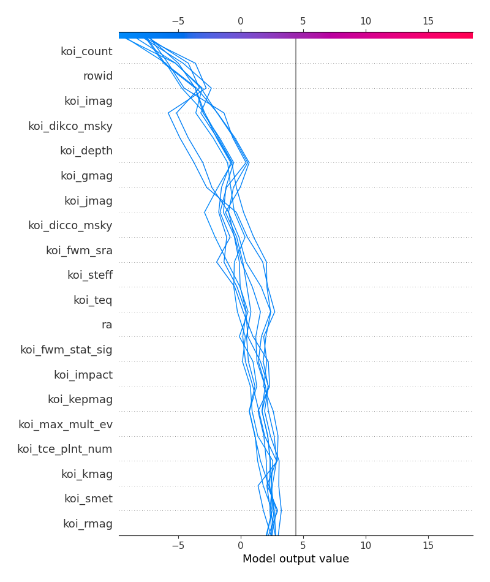
### Top-10 Worst decisions for class 1 (Fold 1)
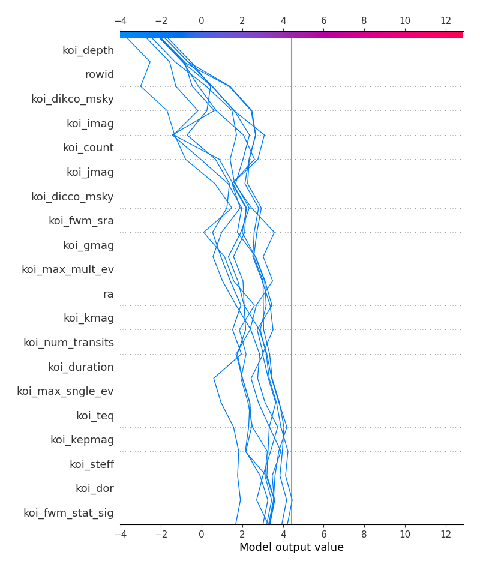
### Top-10 Best decisions for class 1 (Fold 1)
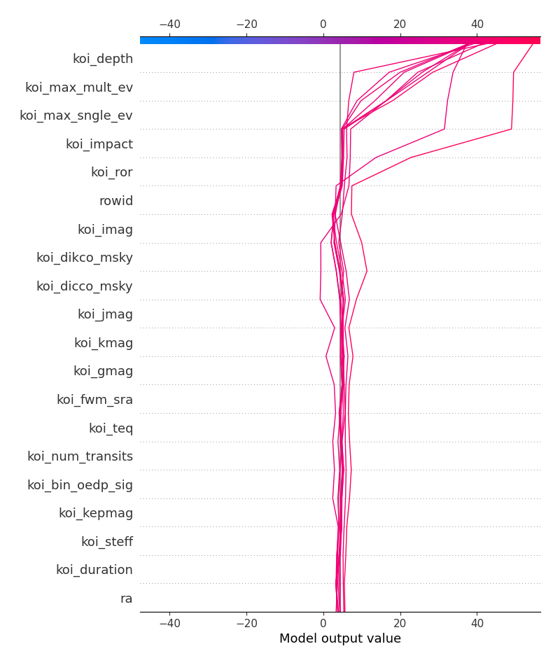

[<< Go back](../README.md)
