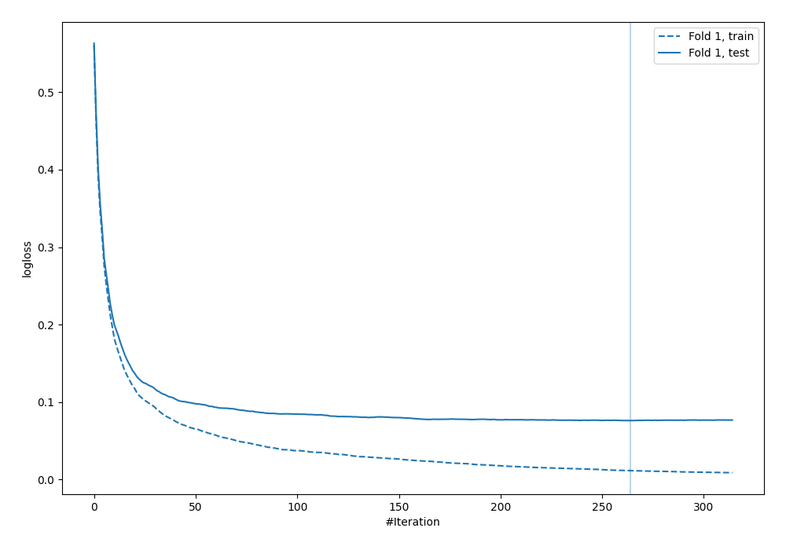
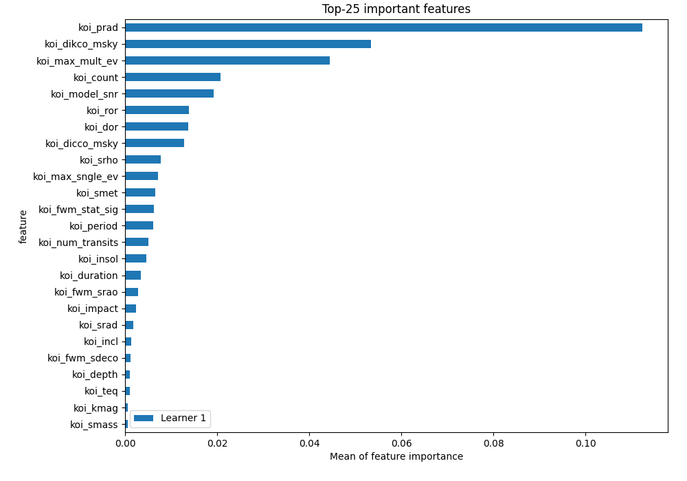
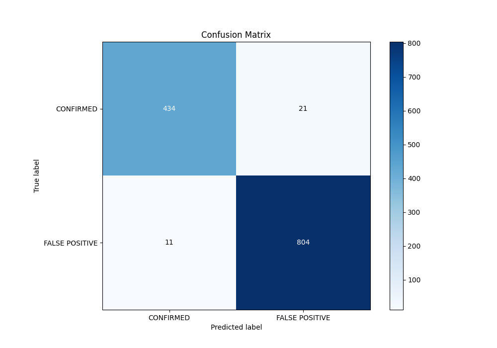
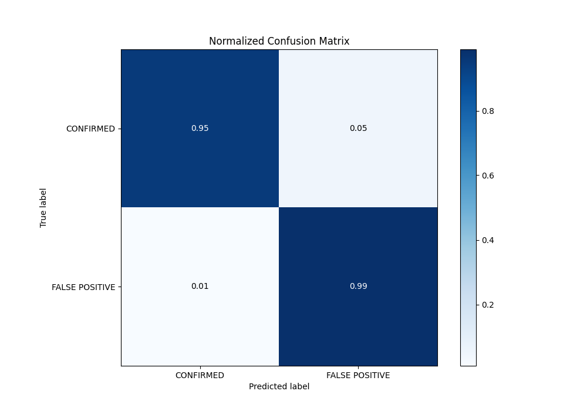
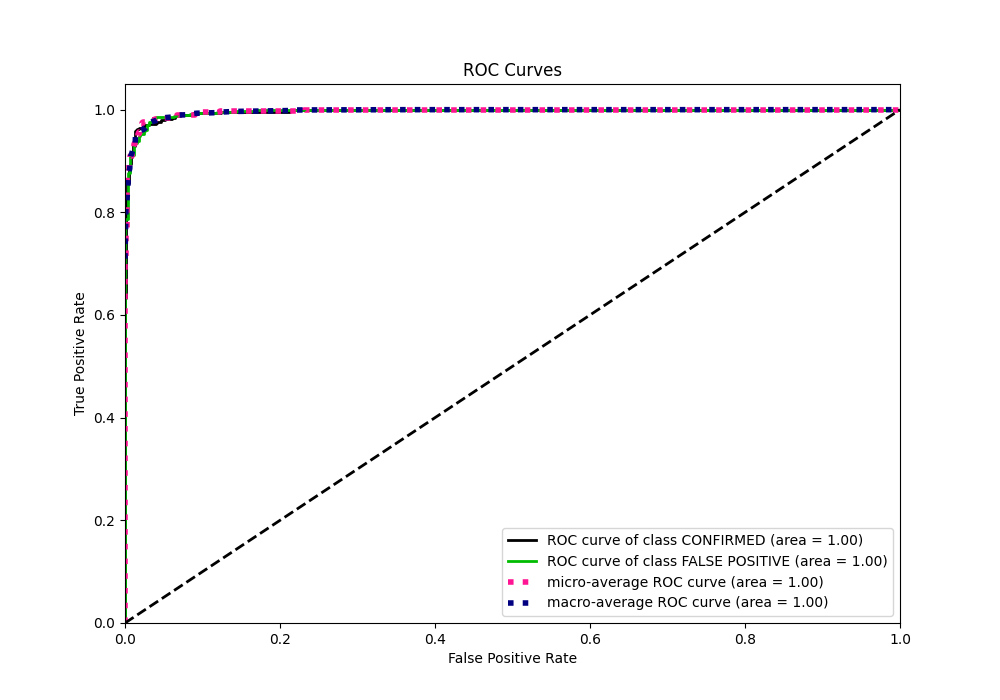
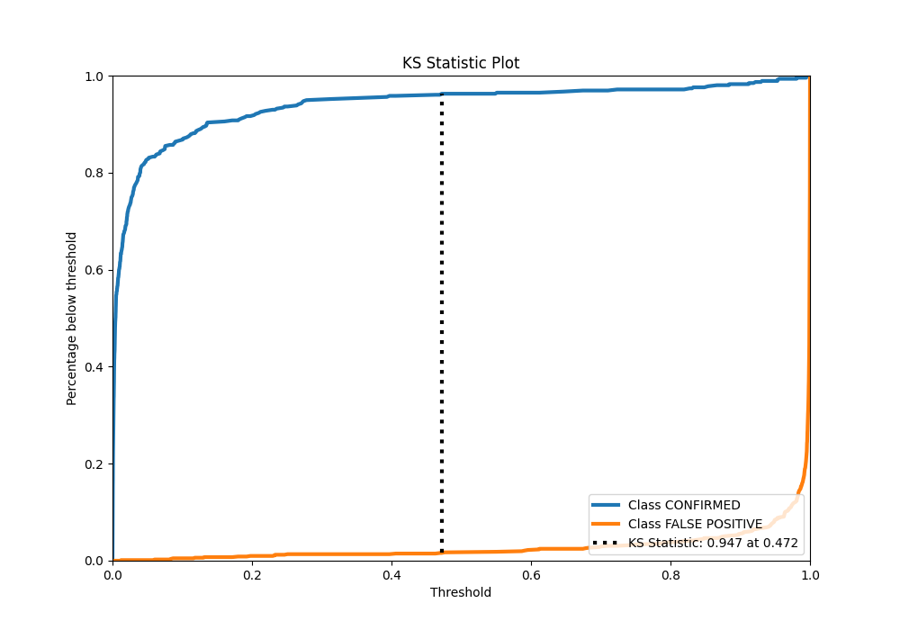
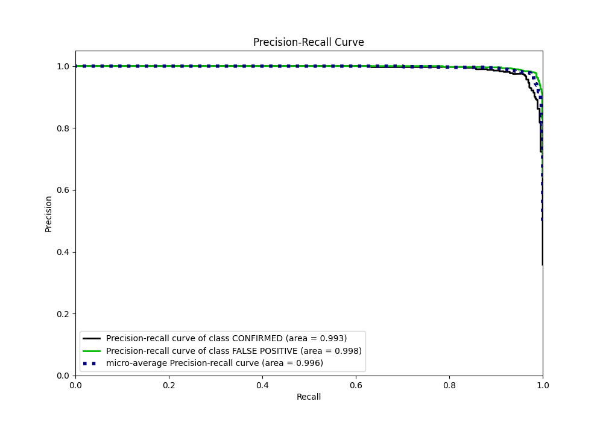
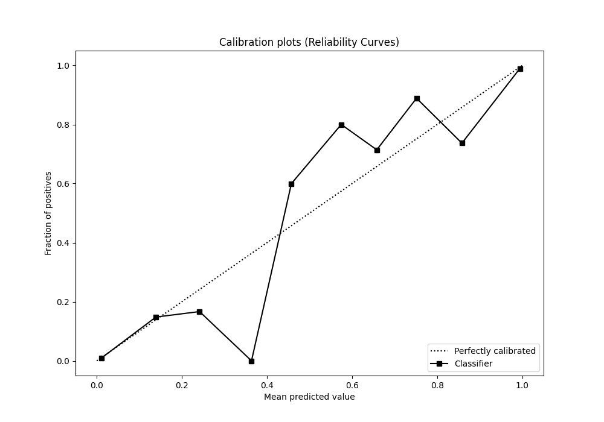
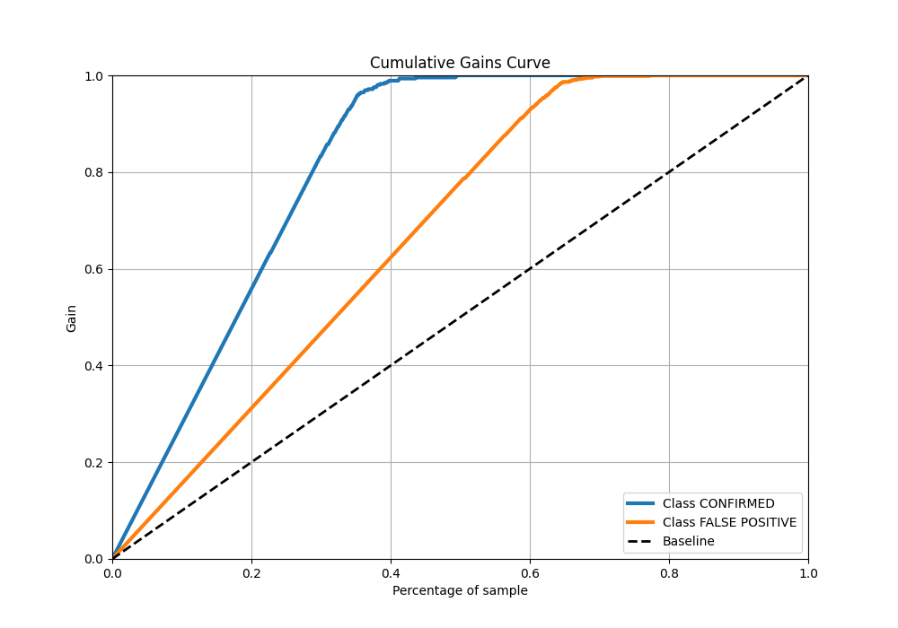
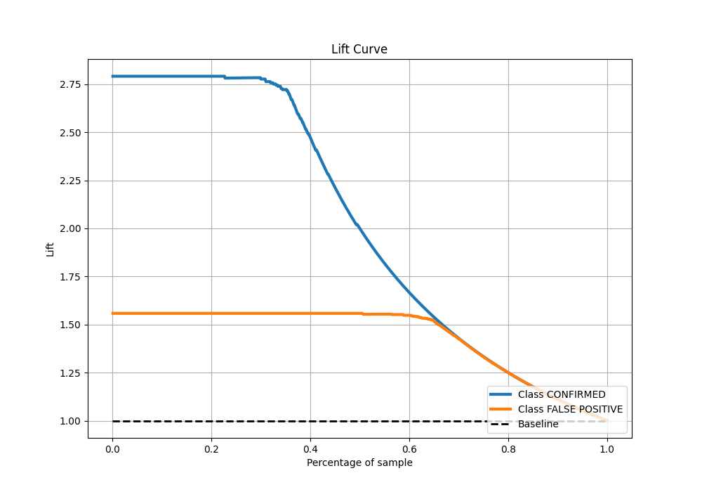

# Summary of 4_Default_CatBoost

[<< Go back](../README.md)

## CatBoost
- **n_jobs**: -1
- **learning_rate**: 0.1
- **depth**: 6
- **rsm**: 1
- **loss_function**: Logloss
- **eval_metric**: Logloss
- **explain_level**: 2

## Validation
 - **validation_type**: split
 - **train_ratio**: 0.75
 - **shuffle**: True
 - **stratify**: True

## Optimized metric
logloss

## Training time

2.3 seconds

## Metric details
|           |     score |     threshold |
|:----------|----------:|--------------:|
| logloss   | 0.0759057 | nan           |
| auc       | 0.996014  | nan           |
| f1        | 0.980488  |   0.37257     |
| accuracy  | 0.974803  |   0.37257     |
| precision | 1         |   0.995323    |
| recall    | 1         |   4.09966e-05 |
| mcc       | 0.945076  |   0.37257     |

## Metric details with threshold from accuracy metric
|           |     score |   threshold |
|:----------|----------:|------------:|
| logloss   | 0.0759057 |   nan       |
| auc       | 0.996014  |   nan       |
| f1        | 0.980488  |     0.37257 |
| accuracy  | 0.974803  |     0.37257 |
| precision | 0.974545  |     0.37257 |
| recall    | 0.986503  |     0.37257 |
| mcc       | 0.945076  |     0.37257 |

## Confusion matrix (at threshold=0.37257)
|                           |   Predicted as CONFIRMED |   Predicted as FALSE POSITIVE |
|:--------------------------|-------------------------:|------------------------------:|
| Labeled as CONFIRMED      |                      434 |                            21 |
| Labeled as FALSE POSITIVE |                       11 |                           804 |

## Learning curves

## Permutation-based Importance

## Confusion Matrix

## Normalized Confusion Matrix

## ROC Curve

## Kolmogorov-Smirnov Statistic

## Precision-Recall Curve

## Calibration Curve

## Cumulative Gains Curve

## Lift Curve

[<< Go back](../README.md)
