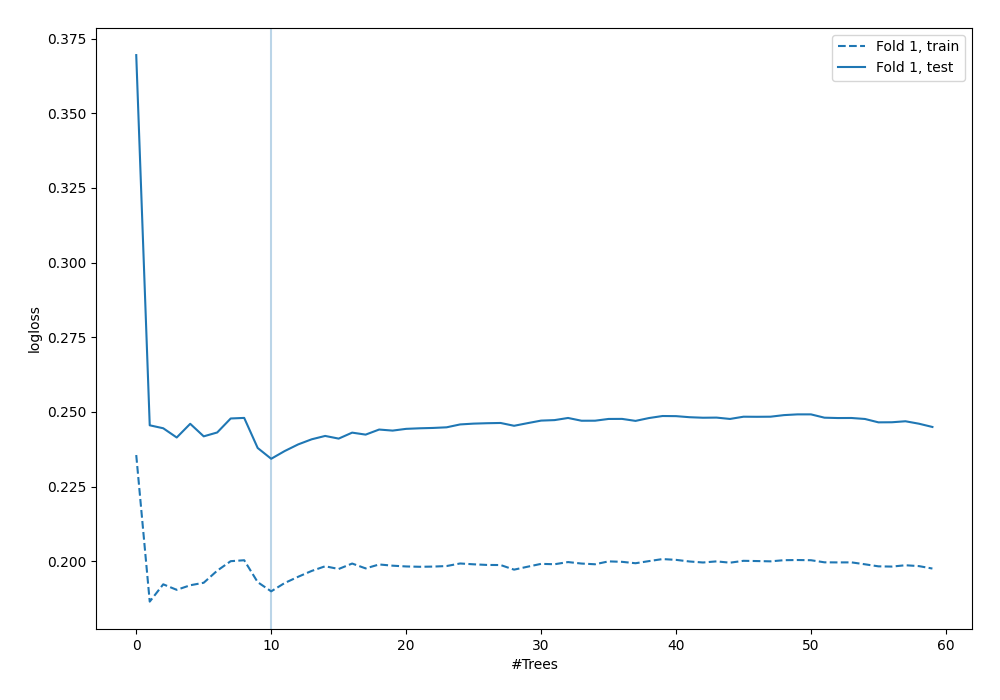
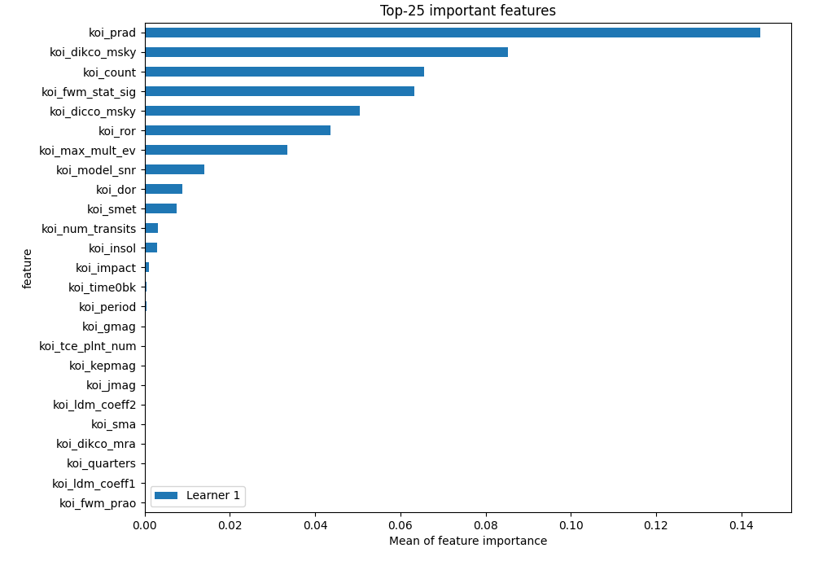
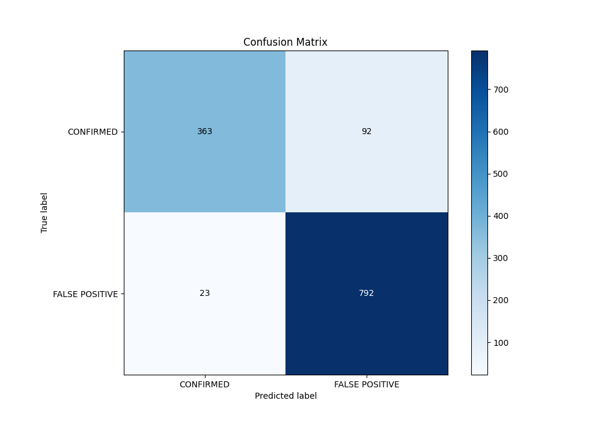
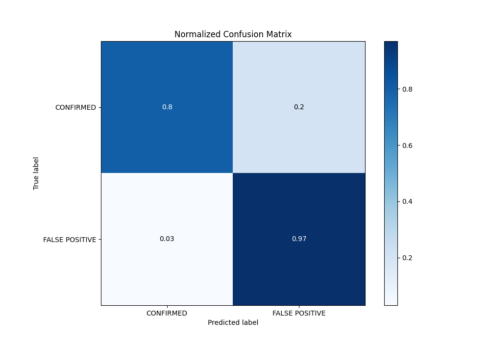
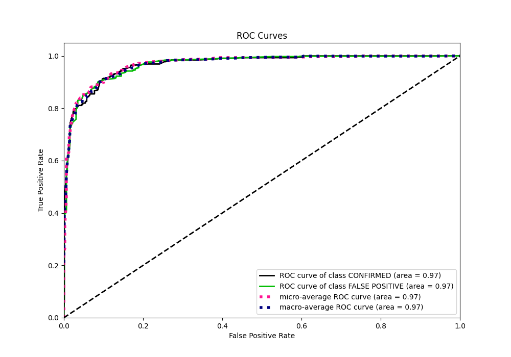
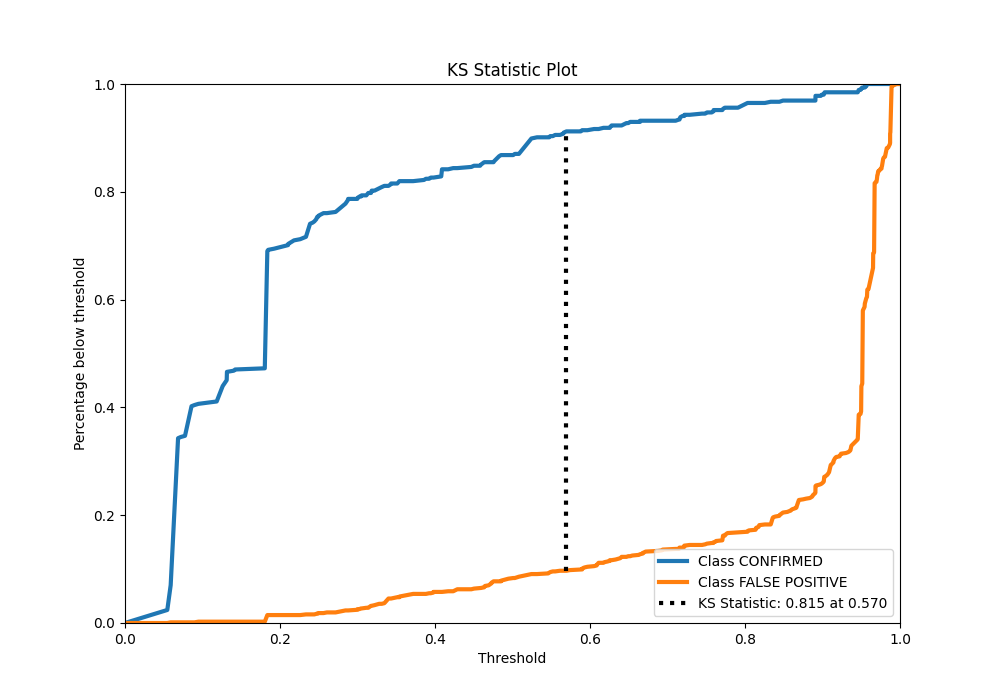
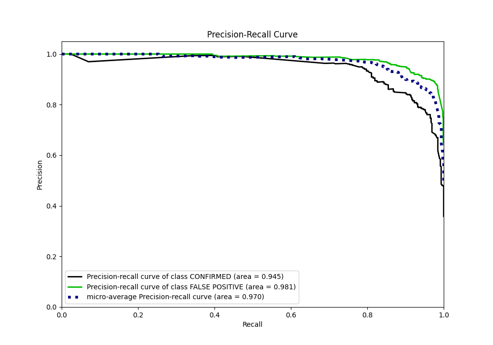
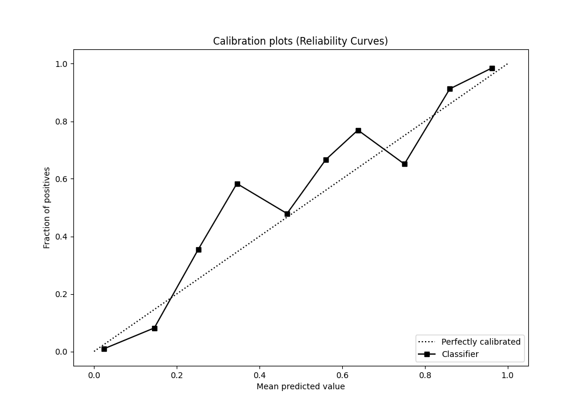
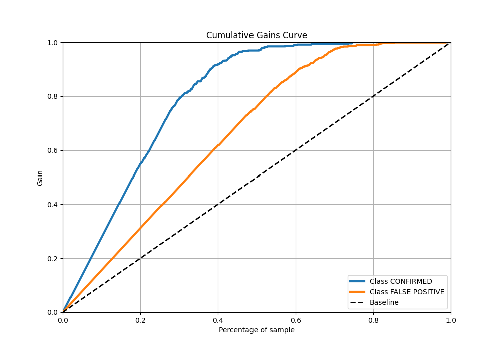
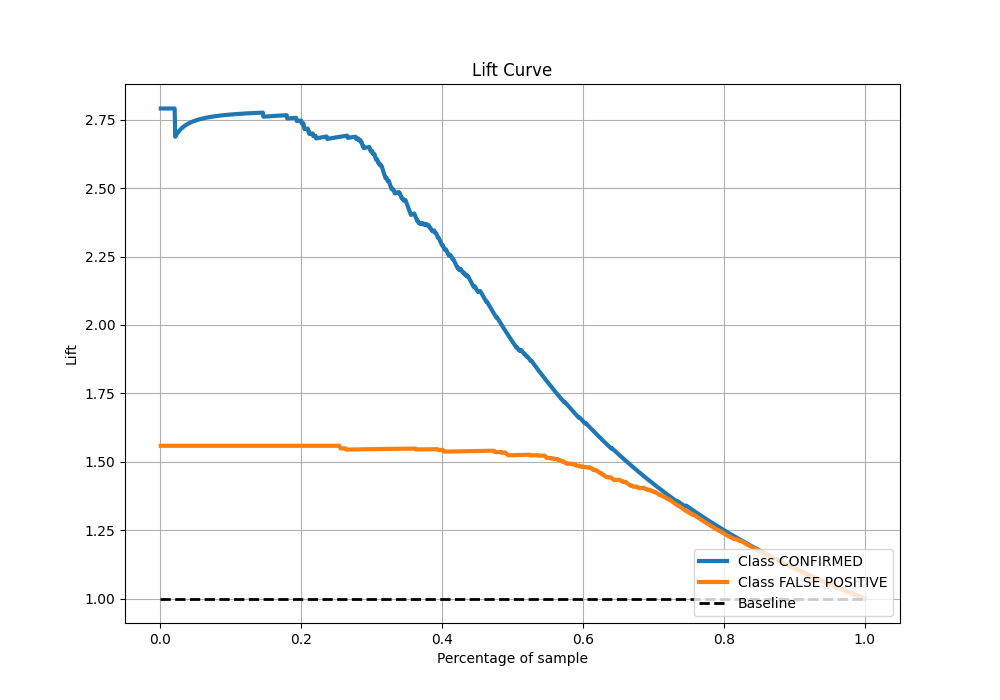

# Summary of 5_Default_RandomForest

[<< Go back](../README.md)

## Random Forest
- **n_jobs**: -1
- **criterion**: gini
- **max_features**: 0.9
- **min_samples_split**: 30
- **max_depth**: 4
- **eval_metric_name**: logloss
- **explain_level**: 2

## Validation
 - **validation_type**: split
 - **train_ratio**: 0.75
 - **shuffle**: True
 - **stratify**: True

## Optimized metric
logloss

## Training time

3.0 seconds

## Metric details
|           |    score |   threshold |
|:----------|---------:|------------:|
| logloss   | 0.234308 | nan         |
| auc       | 0.968137 | nan         |
| f1        | 0.932313 |   0.313915  |
| accuracy  | 0.909449 |   0.313915  |
| precision | 1        |   0.957824  |
| recall    | 1        |   0.0491224 |
| mcc       | 0.802268 |   0.313915  |

## Metric details with threshold from accuracy metric
|           |    score |   threshold |
|:----------|---------:|------------:|
| logloss   | 0.234308 |  nan        |
| auc       | 0.968137 |  nan        |
| f1        | 0.932313 |    0.313915 |
| accuracy  | 0.909449 |    0.313915 |
| precision | 0.895928 |    0.313915 |
| recall    | 0.971779 |    0.313915 |
| mcc       | 0.802268 |    0.313915 |

## Confusion matrix (at threshold=0.313915)
|                           |   Predicted as CONFIRMED |   Predicted as FALSE POSITIVE |
|:--------------------------|-------------------------:|------------------------------:|
| Labeled as CONFIRMED      |                      363 |                            92 |
| Labeled as FALSE POSITIVE |                       23 |                           792 |

## Learning curves

## Permutation-based Importance

## Confusion Matrix

## Normalized Confusion Matrix

## ROC Curve

## Kolmogorov-Smirnov Statistic

## Precision-Recall Curve

## Calibration Curve

## Cumulative Gains Curve

## Lift Curve

[<< Go back](../README.md)
