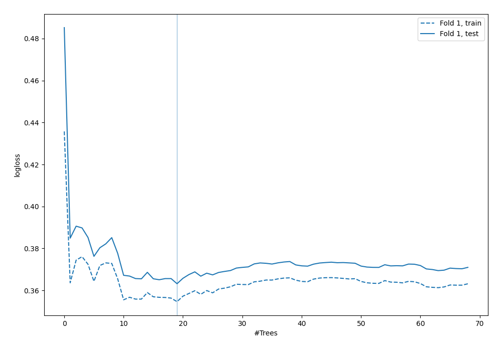
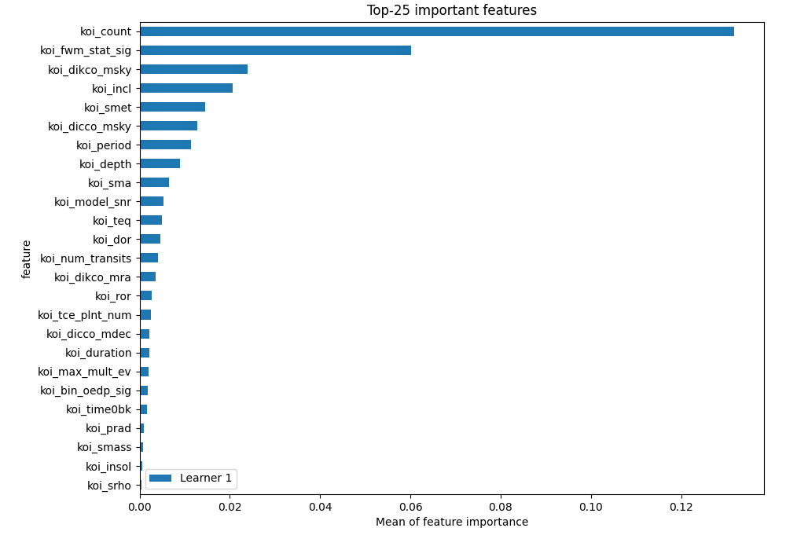
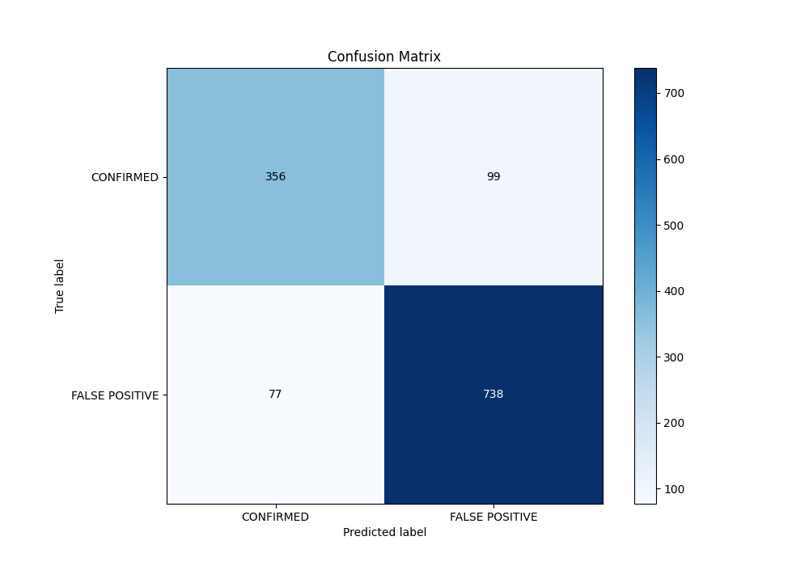
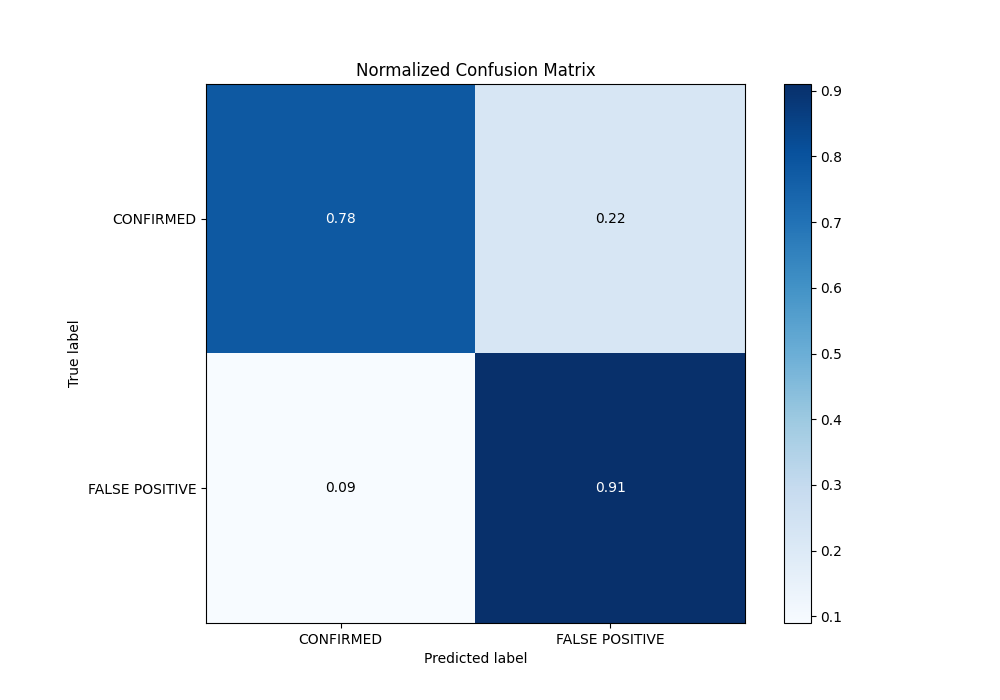
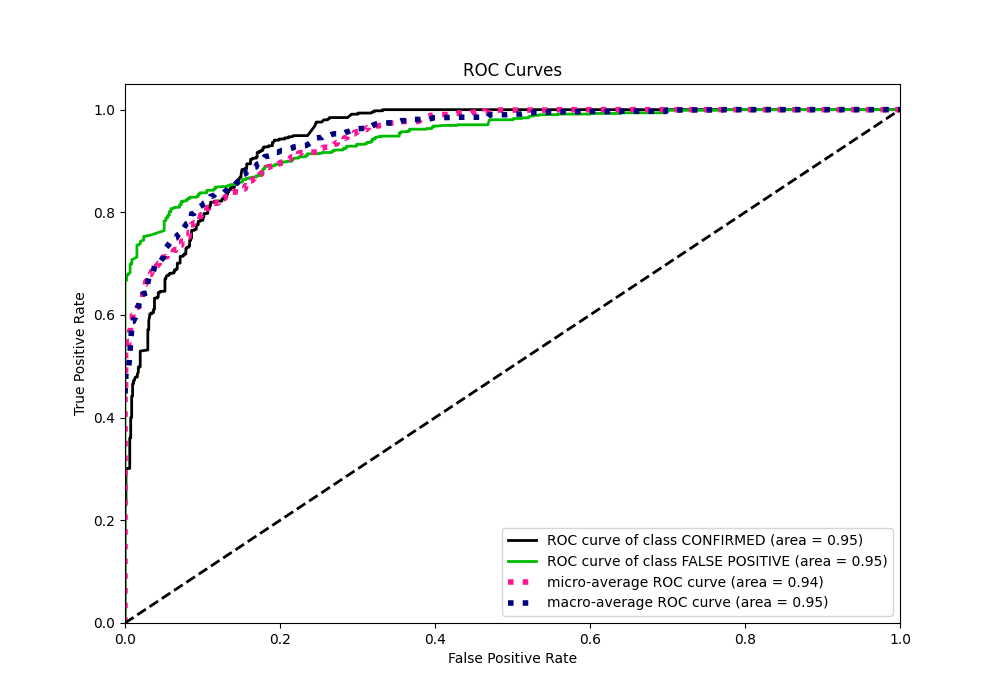
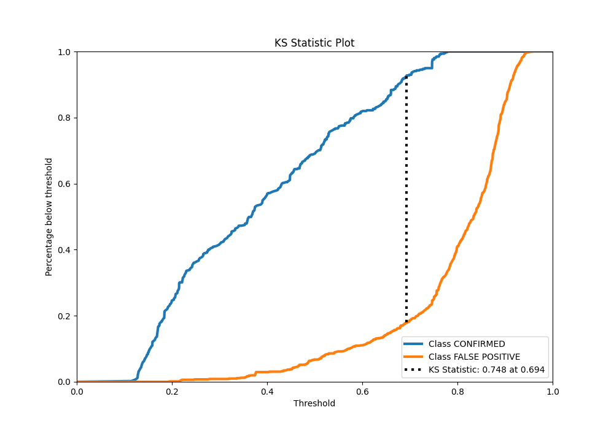
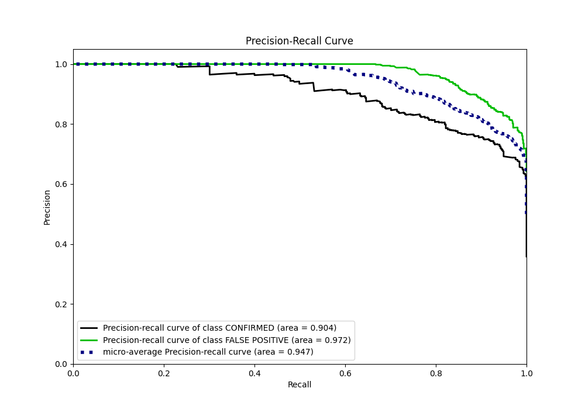
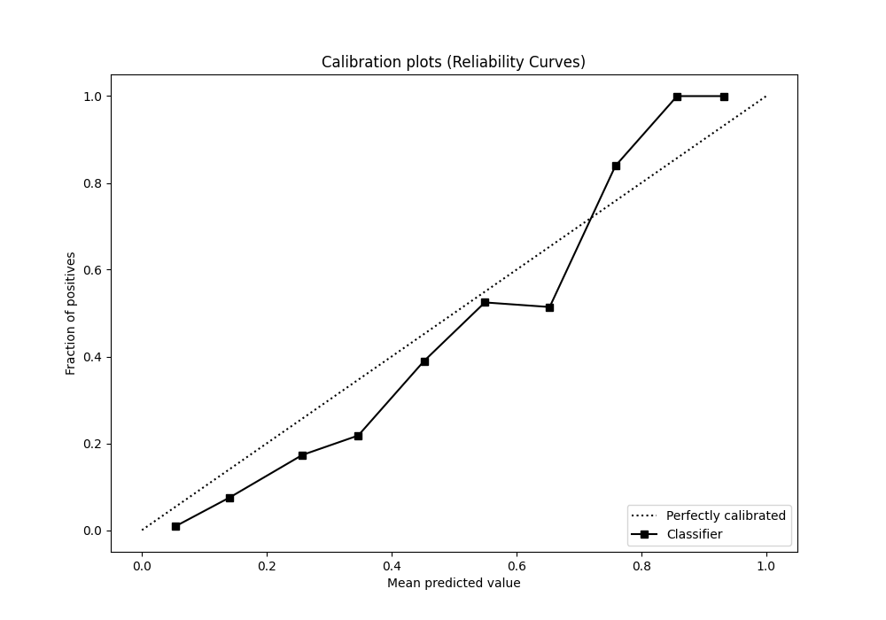
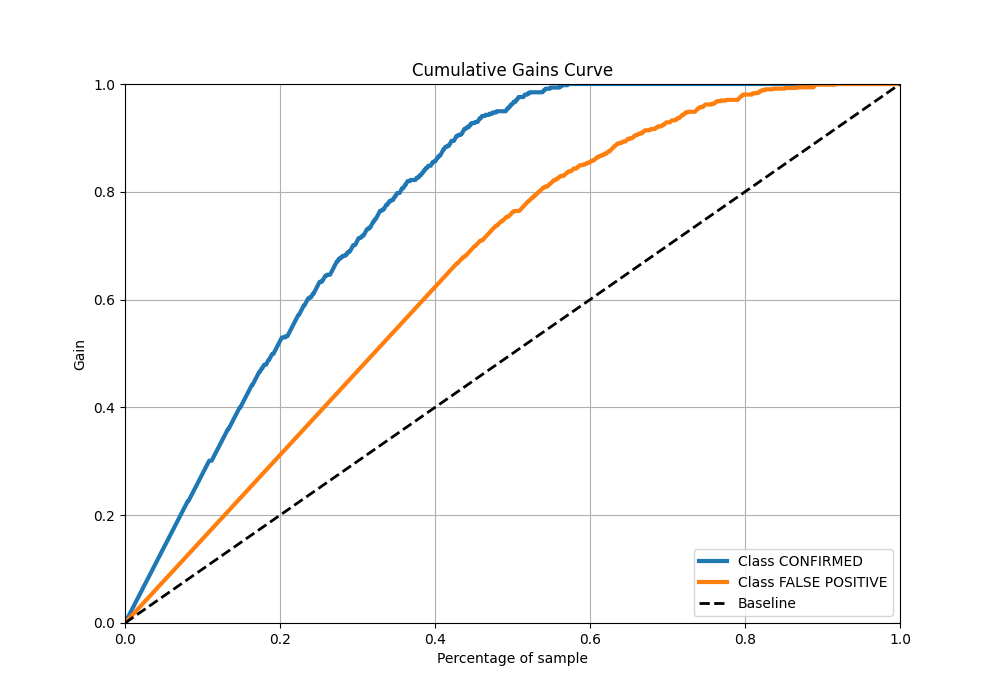
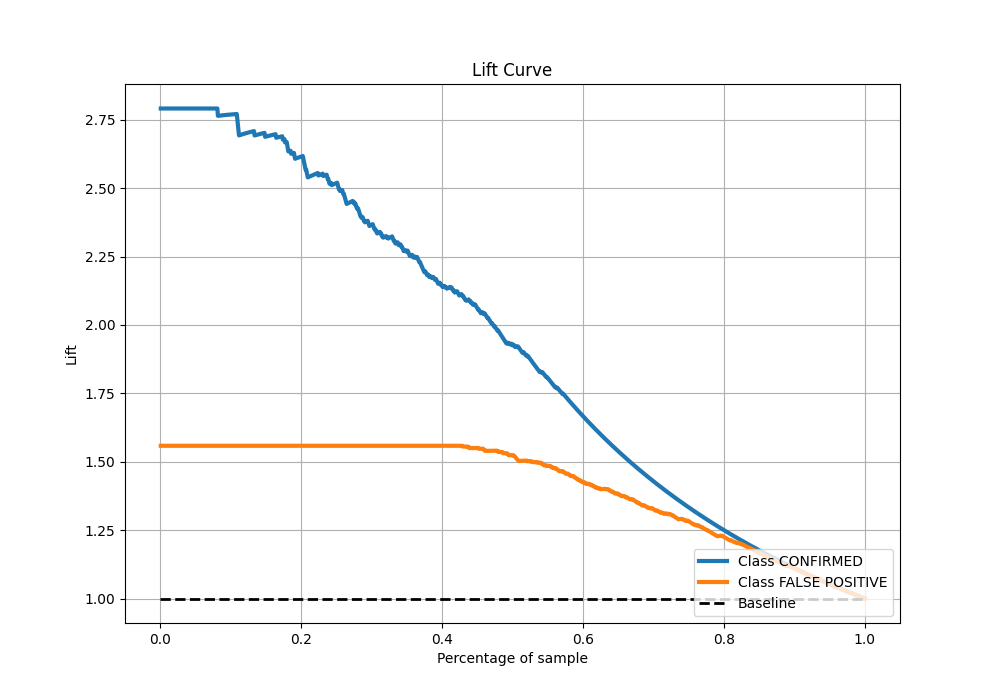

# Summary of 6_Default_ExtraTrees

[<< Go back](../README.md)

## Extra Trees Classifier (Extra Trees)
- **n_jobs**: -1
- **criterion**: gini
- **max_features**: 0.9
- **min_samples_split**: 30
- **max_depth**: 4
- **eval_metric_name**: logloss
- **explain_level**: 2

## Validation
 - **validation_type**: split
 - **train_ratio**: 0.75
 - **shuffle**: True
 - **stratify**: True

## Optimized metric
logloss

## Training time

2.5 seconds

## Metric details
|           |    score |   threshold |
|:----------|---------:|------------:|
| logloss   | 0.363181 |  nan        |
| auc       | 0.945952 |  nan        |
| f1        | 0.893462 |    0.564351 |
| accuracy  | 0.861417 |    0.564351 |
| precision | 1        |    0.782273 |
| recall    | 1        |    0.103251 |
| mcc       | 0.71898  |    0.692002 |

## Metric details with threshold from accuracy metric
|           |    score |   threshold |
|:----------|---------:|------------:|
| logloss   | 0.363181 |  nan        |
| auc       | 0.945952 |  nan        |
| f1        | 0.893462 |    0.564351 |
| accuracy  | 0.861417 |    0.564351 |
| precision | 0.88172  |    0.564351 |
| recall    | 0.905521 |    0.564351 |
| mcc       | 0.695869 |    0.564351 |

## Confusion matrix (at threshold=0.564351)
|                           |   Predicted as CONFIRMED |   Predicted as FALSE POSITIVE |
|:--------------------------|-------------------------:|------------------------------:|
| Labeled as CONFIRMED      |                      356 |                            99 |
| Labeled as FALSE POSITIVE |                       77 |                           738 |

## Learning curves

## Permutation-based Importance

## Confusion Matrix

## Normalized Confusion Matrix

## ROC Curve

## Kolmogorov-Smirnov Statistic

## Precision-Recall Curve

## Calibration Curve

## Cumulative Gains Curve

## Lift Curve

[<< Go back](../README.md)
