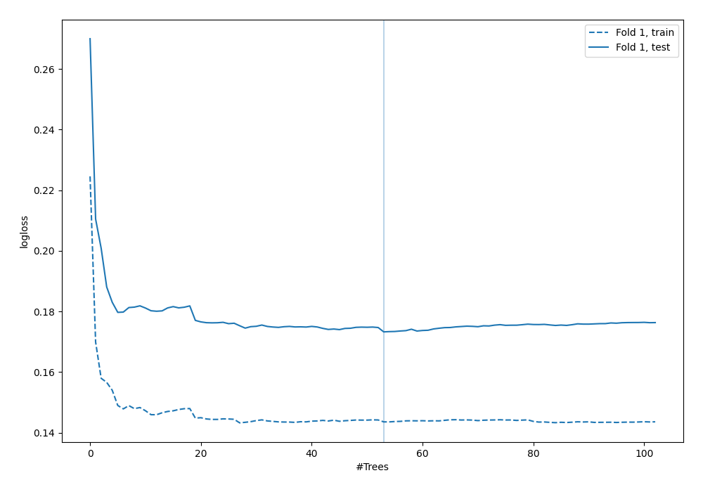
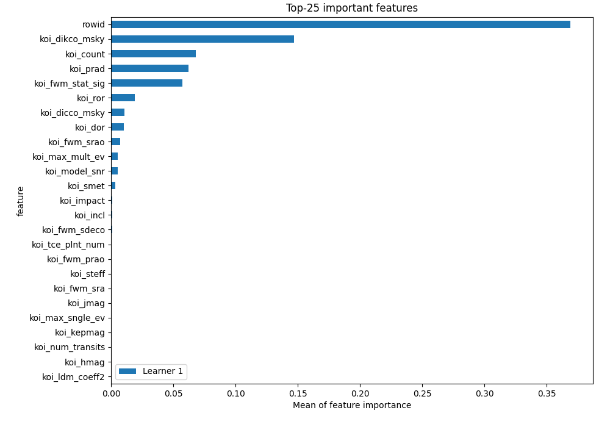
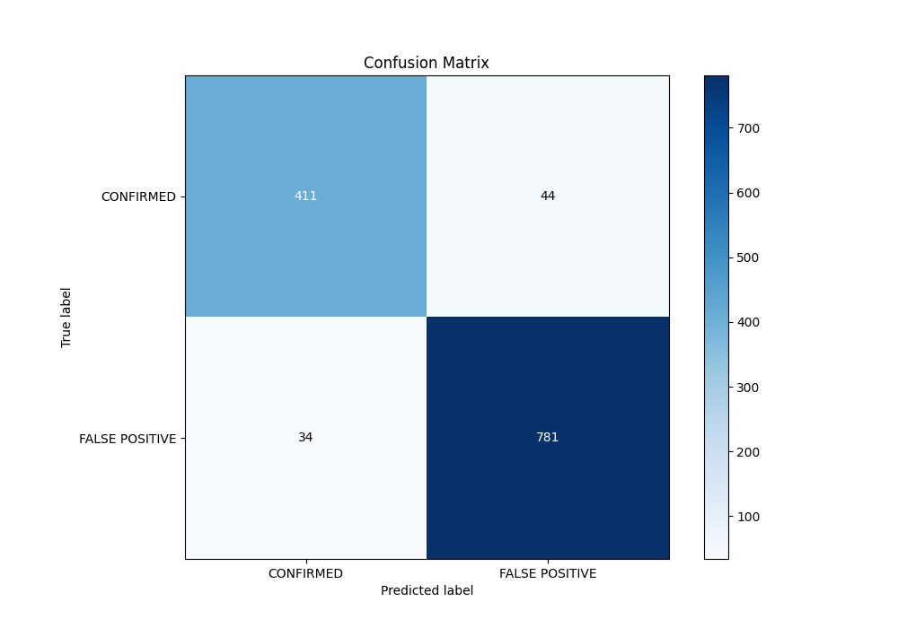
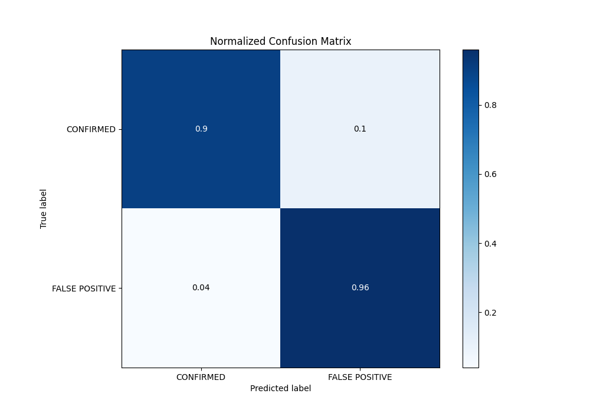
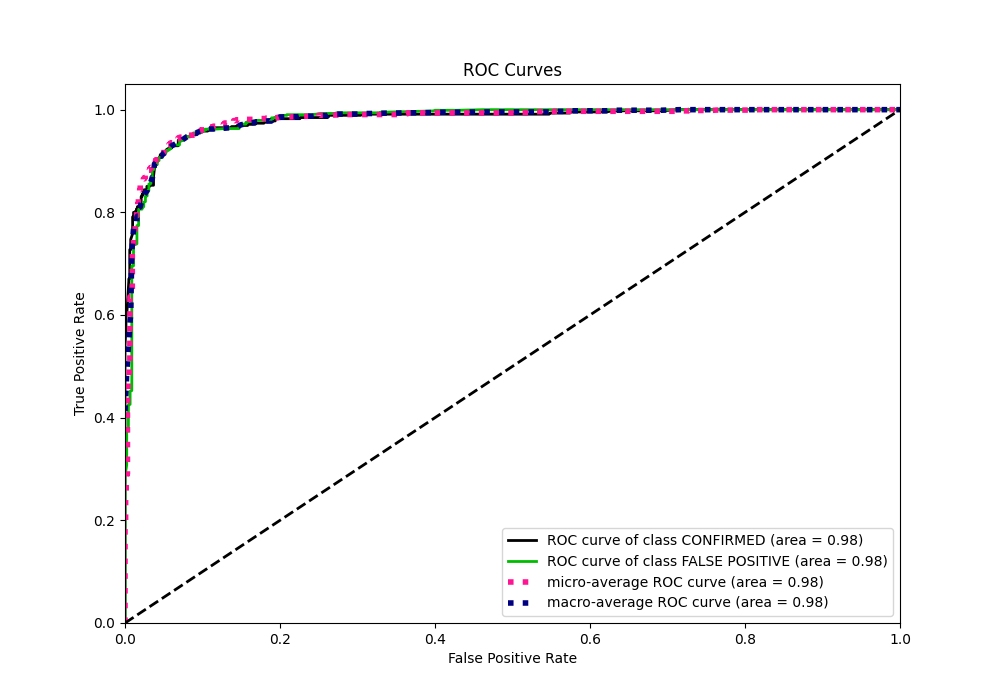
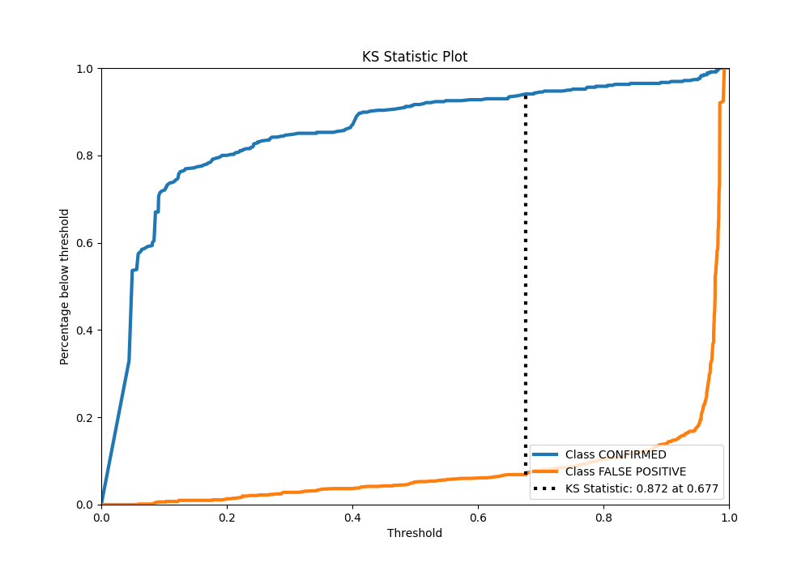
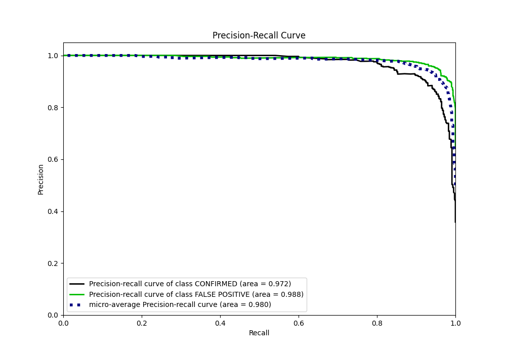
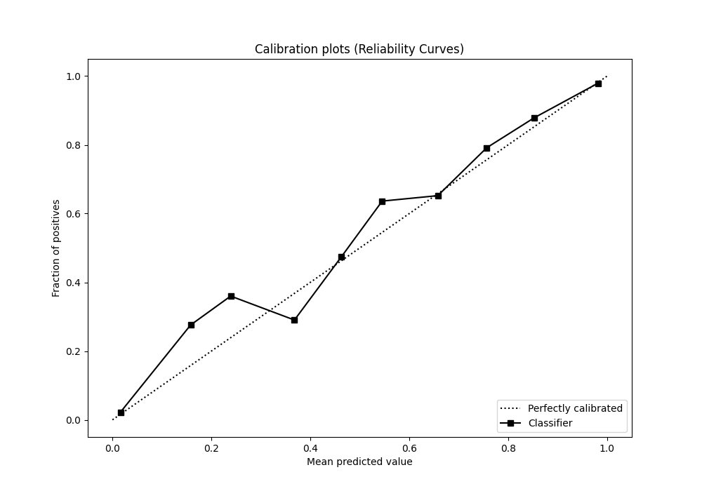
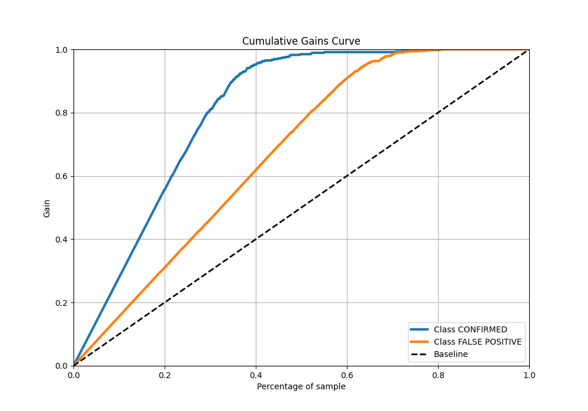
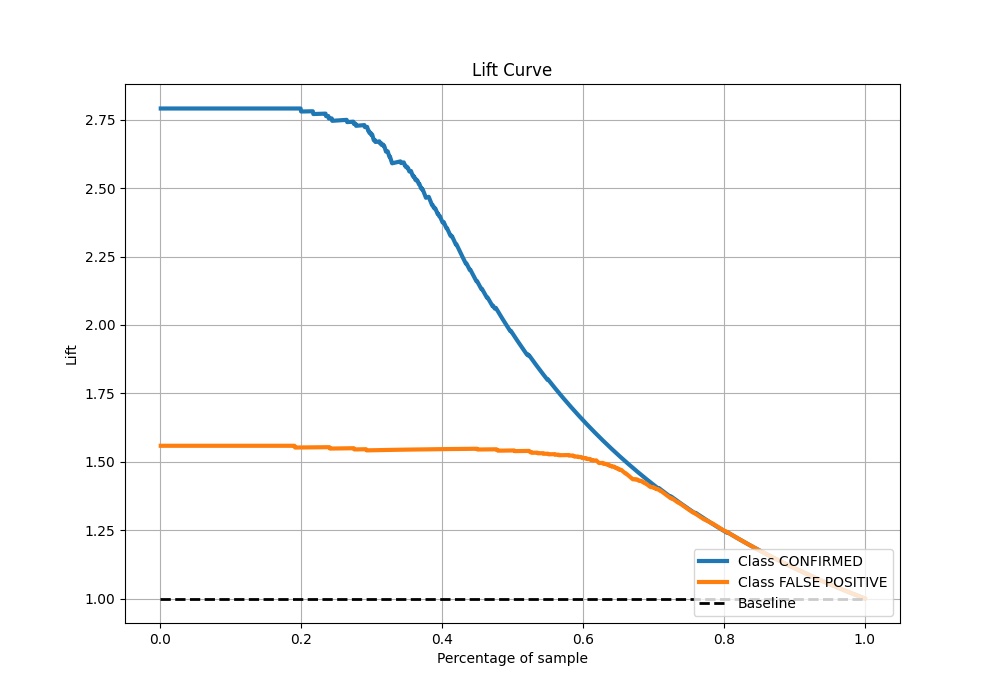

# Summary of 6_Default_RandomForest

[<< Go back](../README.md)

## Random Forest
- **n_jobs**: -1
- **criterion**: gini
- **max_features**: 0.9
- **min_samples_split**: 30
- **max_depth**: 4
- **eval_metric_name**: logloss
- **explain_level**: 2

## Validation
 - **validation_type**: split
 - **train_ratio**: 0.75
 - **shuffle**: True
 - **stratify**: True

## Optimized metric
logloss

## Training time

4.7 seconds

## Metric details
|           |    score |   threshold |
|:----------|---------:|------------:|
| logloss   | 0.173257 | nan         |
| auc       | 0.98057  | nan         |
| f1        | 0.952439 |   0.445515  |
| accuracy  | 0.938583 |   0.445515  |
| precision | 1        |   0.984091  |
| recall    | 1        |   0.0398722 |
| mcc       | 0.86591  |   0.445515  |

## Metric details with threshold from accuracy metric
|           |    score |   threshold |
|:----------|---------:|------------:|
| logloss   | 0.173257 |  nan        |
| auc       | 0.98057  |  nan        |
| f1        | 0.952439 |    0.445515 |
| accuracy  | 0.938583 |    0.445515 |
| precision | 0.946667 |    0.445515 |
| recall    | 0.958282 |    0.445515 |
| mcc       | 0.86591  |    0.445515 |

## Confusion matrix (at threshold=0.445515)
|                           |   Predicted as CONFIRMED |   Predicted as FALSE POSITIVE |
|:--------------------------|-------------------------:|------------------------------:|
| Labeled as CONFIRMED      |                      411 |                            44 |
| Labeled as FALSE POSITIVE |                       34 |                           781 |

## Learning curves

## Permutation-based Importance

## Confusion Matrix

## Normalized Confusion Matrix

## ROC Curve

## Kolmogorov-Smirnov Statistic

## Precision-Recall Curve

## Calibration Curve

## Cumulative Gains Curve

## Lift Curve

[<< Go back](../README.md)
