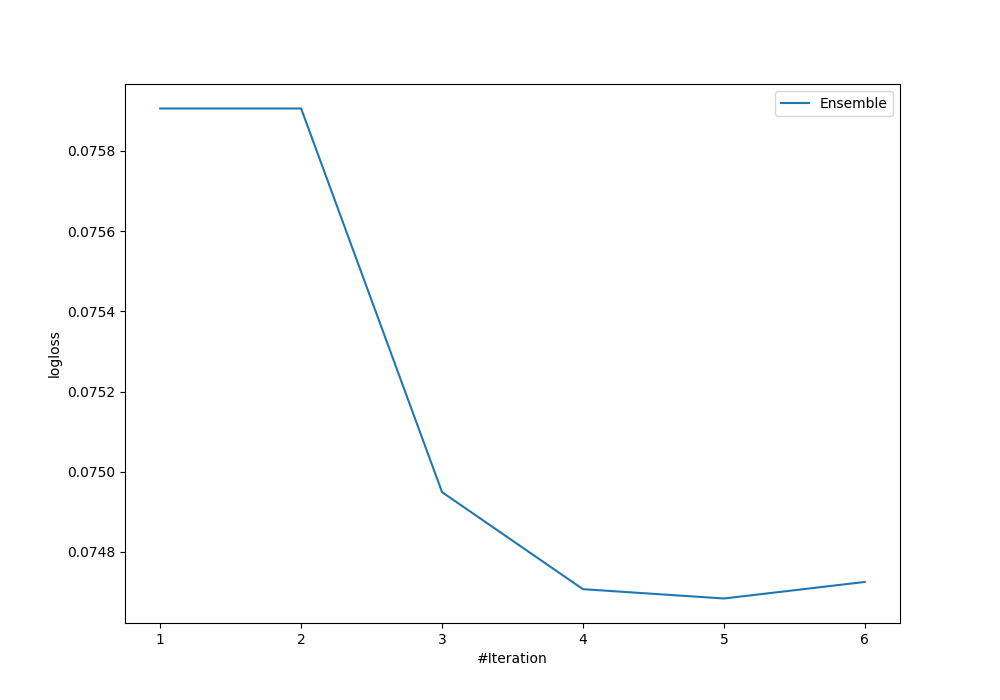
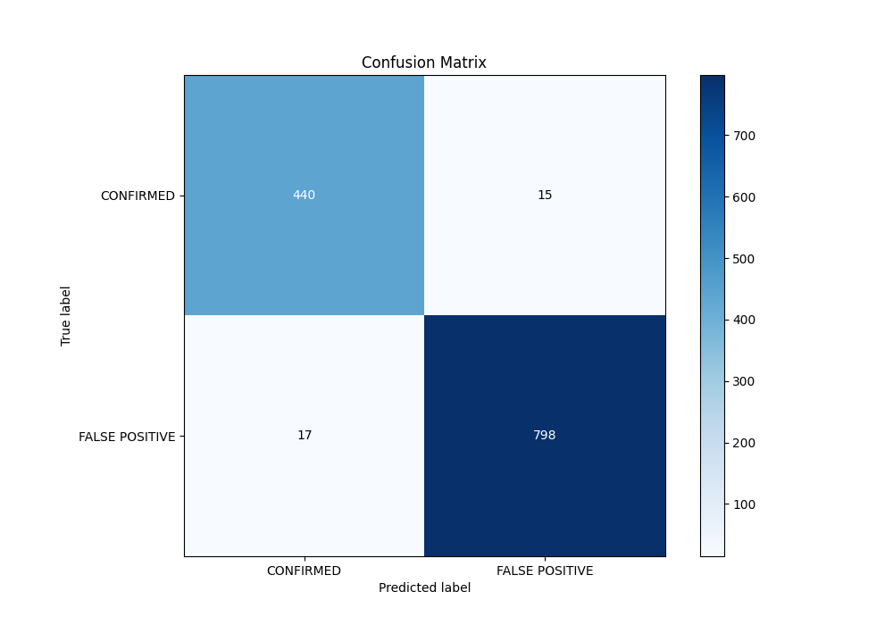
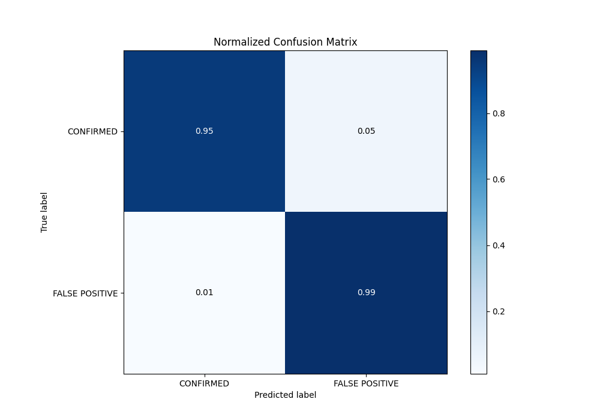
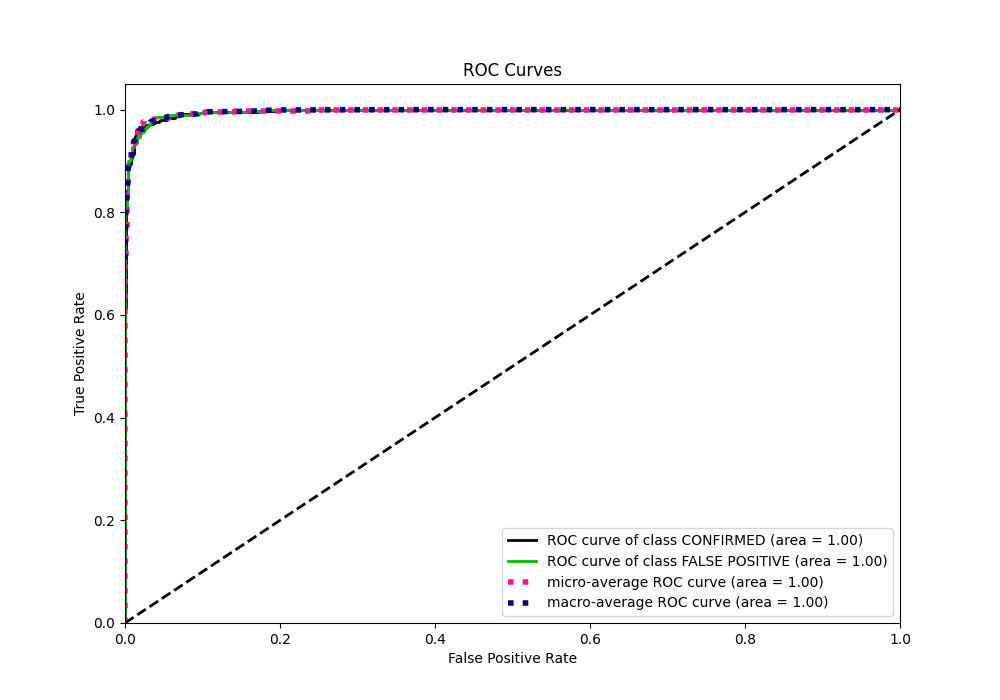
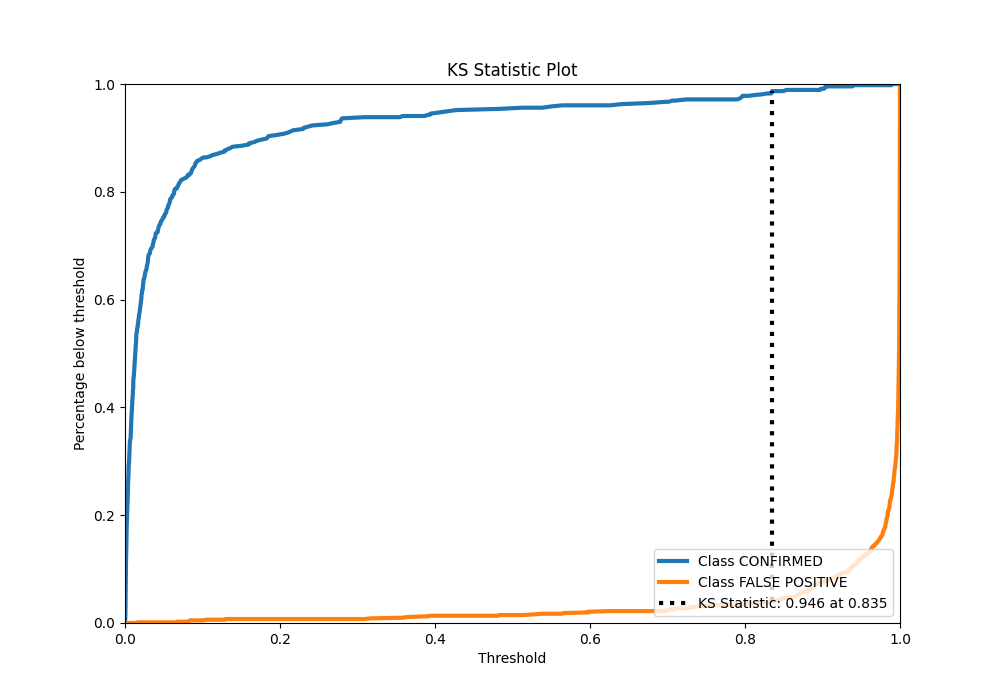
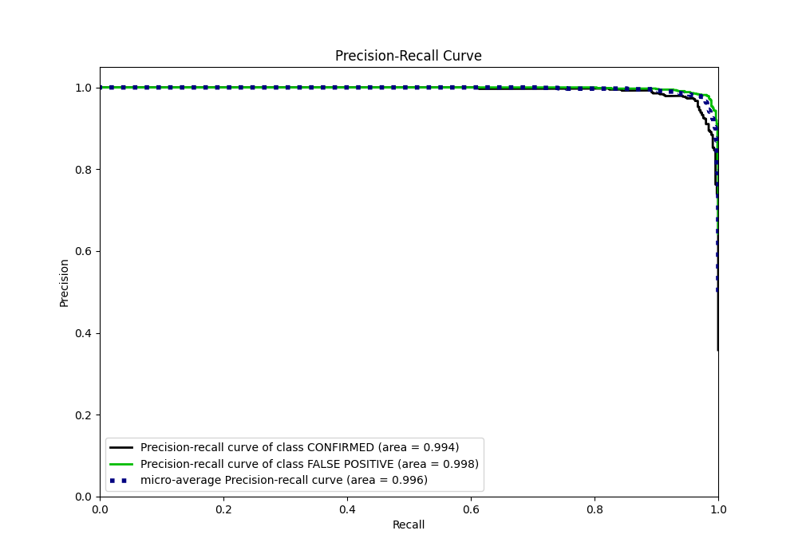
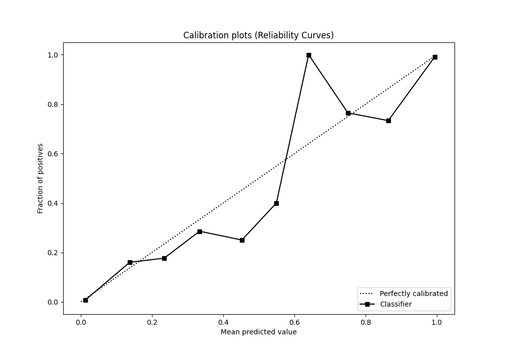
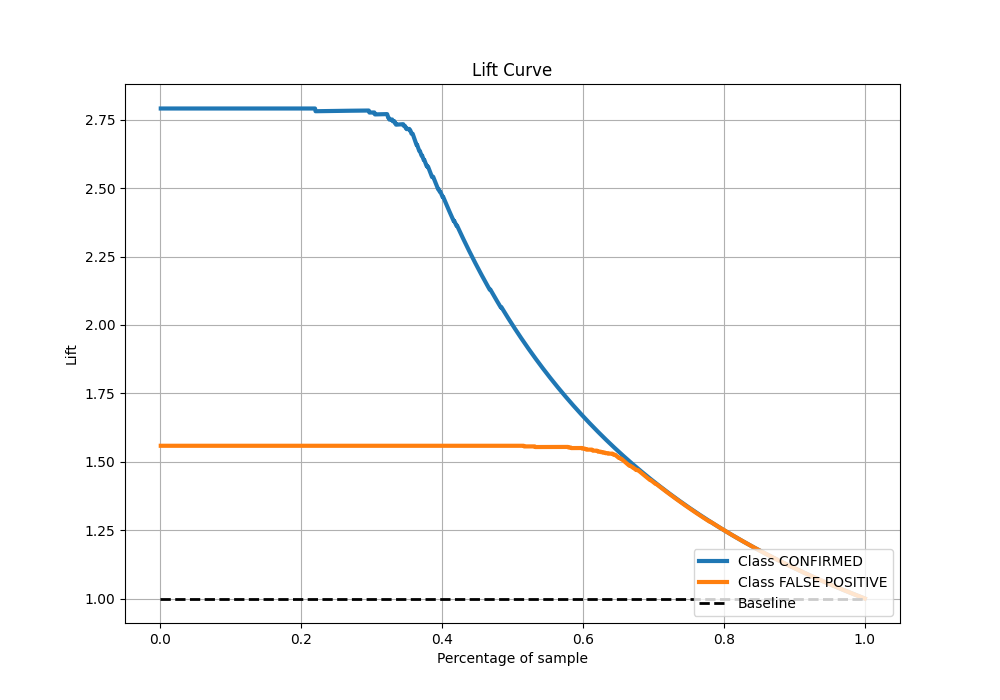

# Summary of Ensemble

[<< Go back](../README.md)

## Ensemble structure
| Model              |   Weight |
|:-------------------|---------:|
| 3_Default_Xgboost  |        1 |
| 4_Default_CatBoost |        4 |

## Metric details
|           |    score |     threshold |
|:----------|---------:|--------------:|
| logloss   | 0.074684 | nan           |
| auc       | 0.996244 | nan           |
| f1        | 0.980344 |   0.622596    |
| accuracy  | 0.974803 |   0.622596    |
| precision | 1        |   0.99416     |
| recall    | 1        |   0.000136718 |
| mcc       | 0.945262 |   0.622596    |

## Metric details with threshold from accuracy metric
|           |    score |   threshold |
|:----------|---------:|------------:|
| logloss   | 0.074684 |  nan        |
| auc       | 0.996244 |  nan        |
| f1        | 0.980344 |    0.622596 |
| accuracy  | 0.974803 |    0.622596 |
| precision | 0.98155  |    0.622596 |
| recall    | 0.979141 |    0.622596 |
| mcc       | 0.945262 |    0.622596 |

## Confusion matrix (at threshold=0.622596)
|                           |   Predicted as CONFIRMED |   Predicted as FALSE POSITIVE |
|:--------------------------|-------------------------:|------------------------------:|
| Labeled as CONFIRMED      |                      440 |                            15 |
| Labeled as FALSE POSITIVE |                       17 |                           798 |

## Learning curves

## Confusion Matrix

## Normalized Confusion Matrix

## ROC Curve

## Kolmogorov-Smirnov Statistic

## Precision-Recall Curve

## Calibration Curve

## Cumulative Gains Curve

## Lift Curve

[<< Go back](../README.md)
