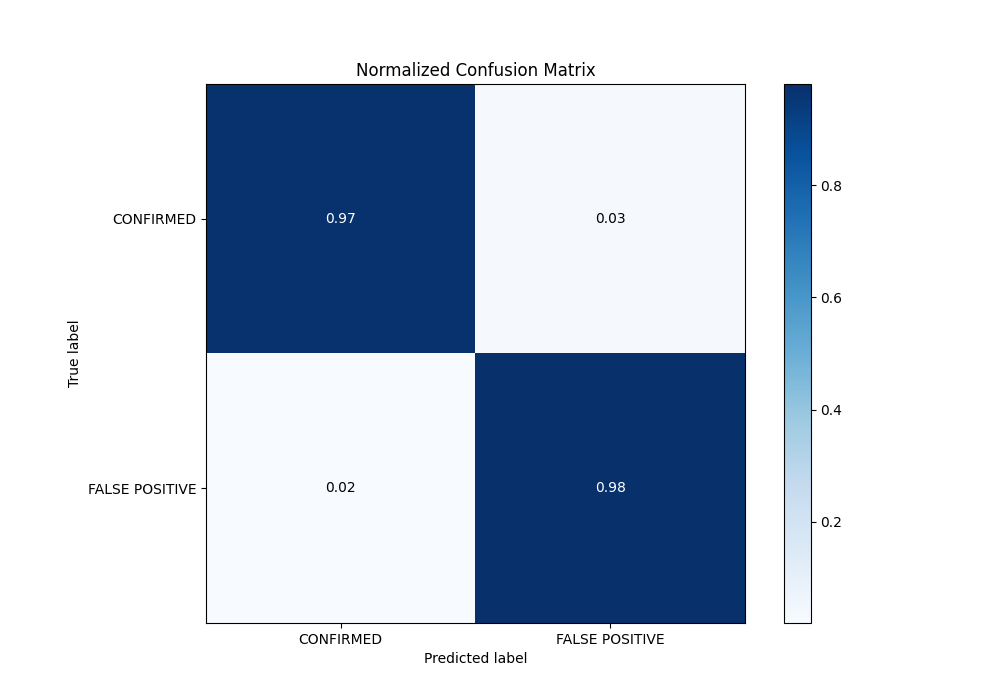
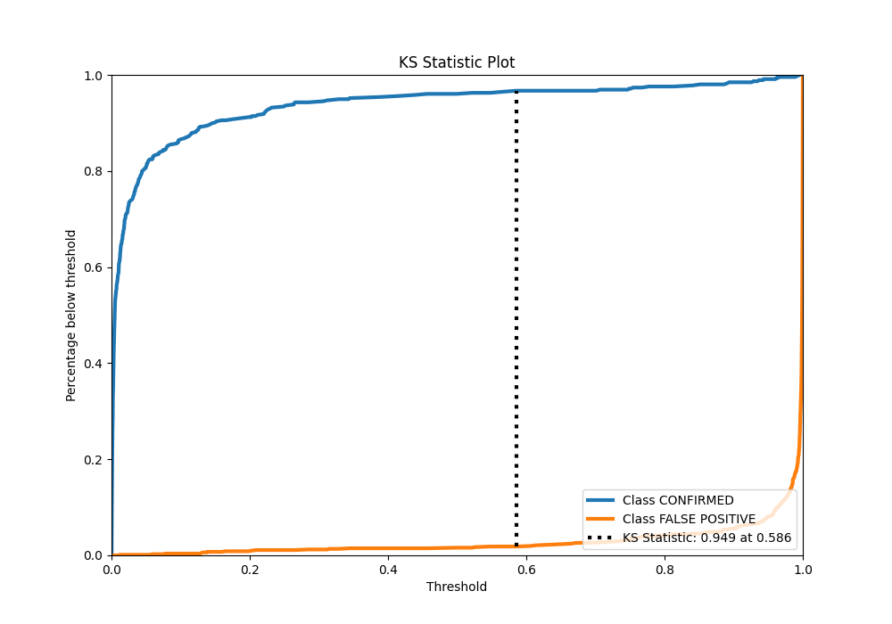

# Summary of Ensemble

[<< Go back](../README.md)

## Ensemble structure
| Model             |   Weight |
|:------------------|---------:|
| 3_Linear          |        1 |
| 4_Default_Xgboost |        5 |

## Metric details
|           |     score |     threshold |
|:----------|----------:|--------------:|
| logloss   | 0.0742588 | nan           |
| auc       | 0.996443  | nan           |
| f1        | 0.980488  |   0.482125    |
| accuracy  | 0.974803  |   0.482125    |
| precision | 1         |   0.989456    |
| recall    | 1         |   0.000187441 |
| mcc       | 0.945076  |   0.482125    |

## Metric details with threshold from accuracy metric
|           |     score |   threshold |
|:----------|----------:|------------:|
| logloss   | 0.0742588 |  nan        |
| auc       | 0.996443  |  nan        |
| f1        | 0.980488  |    0.482125 |
| accuracy  | 0.974803  |    0.482125 |
| precision | 0.974545  |    0.482125 |
| recall    | 0.986503  |    0.482125 |
| mcc       | 0.945076  |    0.482125 |

## Confusion matrix (at threshold=0.482125)
|                           |   Predicted as CONFIRMED |   Predicted as FALSE POSITIVE |
|:--------------------------|-------------------------:|------------------------------:|
| Labeled as CONFIRMED      |                      434 |                            21 |
| Labeled as FALSE POSITIVE |                       11 |                           804 |

## Learning curves

## Confusion Matrix

## Normalized Confusion Matrix

## ROC Curve

## Kolmogorov-Smirnov Statistic

## Precision-Recall Curve

## Calibration Curve

## Cumulative Gains Curve

## Lift Curve

[<< Go back](../README.md)
