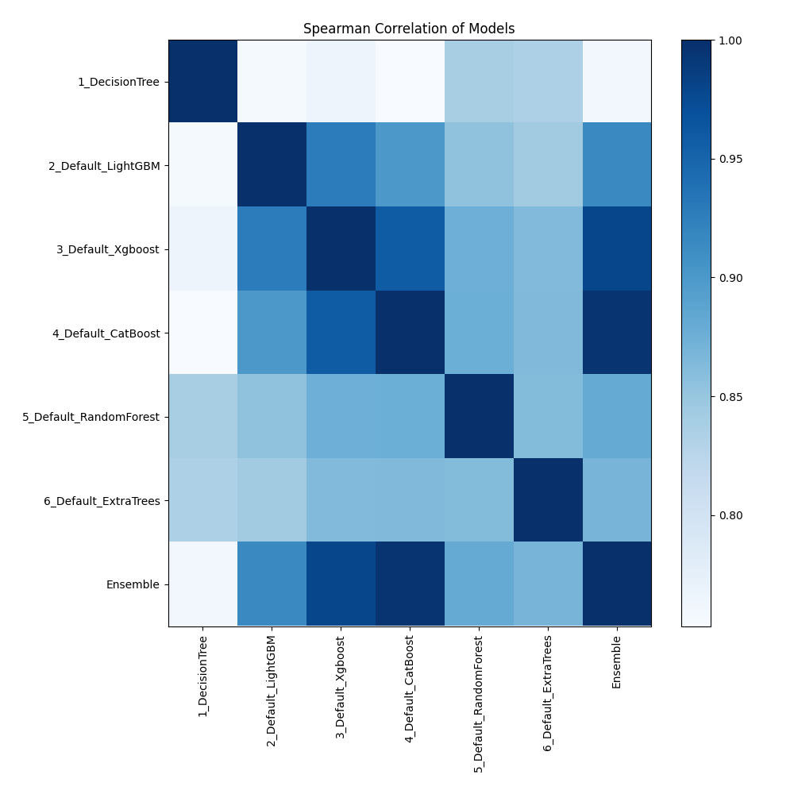

# AutoML Leaderboard

| Best model   | name                                                       | model_type    | metric_type   |   metric_value |   train_time |
|:-------------|:-----------------------------------------------------------|:--------------|:--------------|---------------:|-------------:|
|              | [1_DecisionTree](1_DecisionTree/README.md)                 | Decision Tree | logloss       |      0.377679  |         7.8  |
|              | [2_Default_LightGBM](2_Default_LightGBM/README.md)         | LightGBM      | logloss       |      0.102785  |         4.36 |
|              | [3_Default_Xgboost](3_Default_Xgboost/README.md)           | Xgboost       | logloss       |      0.0883173 |         2.47 |
|              | [4_Default_CatBoost](4_Default_CatBoost/README.md)         | CatBoost      | logloss       |      0.0759057 |         2.99 |
|              | [5_Default_RandomForest](5_Default_RandomForest/README.md) | Random Forest | logloss       |      0.234308  |         3.65 |
|              | [6_Default_ExtraTrees](6_Default_ExtraTrees/README.md)     | Extra Trees   | logloss       |      0.363181  |         3.23 |
| **the best** | [Ensemble](Ensemble/README.md)                             | Ensemble      | logloss       |      0.074684  |         0.74 |

### AutoML Performance

### AutoML Performance Boxplot

### Features Importance

### Spearman Correlation of Models

